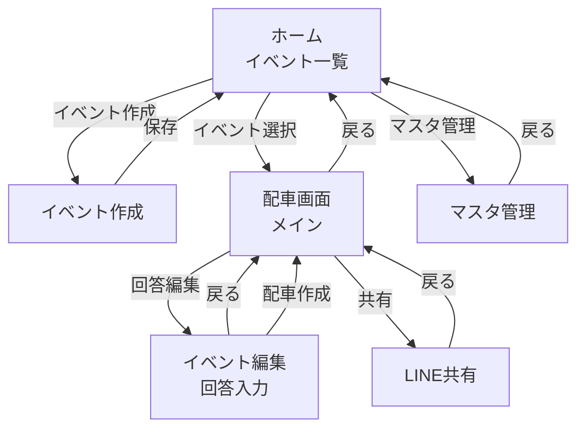

# 1. 目的

配車担当・管理者が実際に使う画面を、実装可能なレベルまで定義する。

---

# 2. アプリ名

**CarpoolBridge**

---

# 3. 設計方針（配車担当の思考順に合わせる）

配車担当は概ね以下の順番で考える（01_現状業務分析・07_配車アルゴリズムと共通）。

```
集合場所ごとに分ける
↓
車を決める
↓
定員確認
↓
方向確認
↓
微調整
```

この思考順に沿って、

「集合場所がひと目に分かる」
→「車カード単位でまとまって見える」
→「ドラッグ＆ドロップで直感的に修正できる」

ことを重視する。

このアプリの最重要価値は、

> 「配車作成」ボタンを押して、80〜90%完成した配車案が10秒程度で出てくること

である。配車担当が一番困っているのは「定員オーバー」と「乗せ忘れ」なので、
この2つは常に画面上で目立たせる。

---

# 4. 画面一覧

1. ホーム（イベント一覧）
2. イベント作成
3. 配車画面（メイン）
4. イベント編集 回答入力
5. LINE共有
6. マスタ管理

## 画面遷移



---

# 5. ホーム（イベント一覧）

```
┌─────────────────────────┐
│ CarpoolBridge           │
├─────────────────────────┤
│ ● 7/19(土) 通常練習       │ ← 本日のイベント（強調表示）
│ 7/26(日) 公式戦 △△球場    │
│                           │
│ ▼ 過去のイベント（3件）    │ ← 初期状態は折りたたみ
│                           │
│         [+ イベント作成]   │
└─────────────────────────┘
```

* 日付順の一覧表示とし、曜日も表示する
* 本日のイベントは色やアイコンで強調表示する
* 本日以降のイベントを一覧上部に表示する
* 開催日を過ぎたイベントは初期状態では折りたたみ、「過去のイベント（n件）」の行をタップすると展開する
  * 展開後はグレーアウトして表示する
  * 過去のイベントが0件の場合、この行自体を表示しない
* 本日以降のイベントが0件の場合は「今後の予定はありません」を表示する
* イベントの状態（開催予定・本日・終了）はラベル表示せず、表示スタイルで表現する
* タップで配車画面へ遷移する
* 画面下部固定ナビゲーションは置かない

---

# 6. イベント作成

```
┌─────────────────────────┐
│ イベント作成              │
├─────────────────────────┤
│ イベント名                │
│ [__________________]     │
│                          │
│ 日付                     │
│ [2026/07/12]             │
│                          │
│ 目的地                   │
│ ▼ ○○小学校（登録された目的地から選択）│
│                          │
│         [保存]           │
└─────────────────────────┘
```

---

# 7. イベント編集 回答入力

参加有無・車出し・乗車可能人数・特記事項など、イベントに関する回答情報を
まとめて編集する画面。単なる「回答の入力」ではなく、後からいつでも
修正できる「編集」画面として位置づける。

家庭ごとにカードをまとめ、その中に所属する子供（1人〜複数人）の回答を並べる。
LINE返信自体が家庭単位で届くため、入力の単位も家庭に合わせる。

```
┌─────────────────────────┐
│ 7/12(土) 練習試合          │
├─────────────────────────┤
│ 山田家                    │
│  車出し(行き) [可][不可]  │
│  車出し(帰り) [可][不可]  │
│  乗車可能人数 [ 5 ]人      │ ← 未変更時は初期値を薄字で表示
│  ─────────────────      │
│  太郎（小6）[選手]          │
│   参加 [○][✕]              │
│   □ 行きの配車不要         │
│   □ 帰りの配車不要         │
│  ─────────────────      │
│  花（小3）[選手]            │
│   参加 [○][✕]              │
│   □ 行きの配車不要         │
│   □ 帰りの配車不要         │
│  ─────────────────      │
│  山田父 [コーチ]            │
│   参加 [○][✕]              │
│   □ 行きの配車不要         │
│   □ 帰りの配車不要         │
│  ─────────────────      │
│  備考 [______________]  │
├─────────────────────────┤
│ 佐藤家                    │
│  車出し(行き) [可][不可]  │
│  車出し(帰り) [可][不可]  │
│  乗車可能人数 [ 4 ]人    │ ← 変更時は数値を保存して強調
│  ─────────────────      │
│  花子（小4）[選手]     │
│   参加 [○][✕]              │
│   □ 行きの配車不要         │
│   □ 帰りの配車不要         │
│  ─────────────────      │
│   備考 [______________]  │
│  ...                    │
├─────────────────────────┤
│ [戻る]        [配車作成] │
└─────────────────────────┘
```

- 備考は家庭単位で入力する。
- 学年を表示する
- 初期値を薄字でプレースホルダー表示する
  当日の荷物等で人数が変動する場合は、担当者が数値を上書き変更できる。変更されると、画面上では通常字＋アイコン等で「変更済み」であることが分かるように表示する
- 乗車可能人数が0人の場合、車出し（行き／帰り）の[可]ボタンは選択不可にする（矛盾した回答を防ぐため）。
  * 既に[可]が選択された状態で人数が0になった場合は、選択状態はそのまま維持し、ボタン操作のみ無効にする（値を自動的に書き換えない）
  * [不可]ボタンは人数によらず常に操作可能とする
  * 人数を1以上に戻すと、[可]ボタンは再び操作可能になる
- 家庭に紐づくコーチが存在する場合のみ、家庭カード内に追加表示する（該当コーチがいない家庭では非表示）。
- カード内に子供ごとの回答（参加・行きの配車不要・帰りの配車不要）を1人ずつ並べる（兄弟が複数人いる家庭でも、1枚のカードで完結する）
- 「現地集合」「保護者迎え」などの特殊なケースもすべて、「行きの配車不要」「帰りの配車不要」のチェックボックスで表現する。それ以外の例外事項は備考欄に入力する
- **参加ボタンは3状態とする。**
  * 初期状態では○✕とも未選択状態で表示する
  * 初期状態は未回答とし、○✕どちらのボタンも非選択（グレー表示）とする
  * ○または✕をタップすると該当ボタンが選択色に変わる
  * タップ後も再タップにより○⇔✕の変更は可能
  * 未回答であることのラベル表示（⚠️等）は今回は実装しない
- 「保存」ボタンは置かない。入力した瞬間に自動保存する（11章の自動保存方針と統一）。
- 画面下部には「配車作成」のボタンを配置する
- 「戻る」を押した場合は、配車画面へ戻る。回答内容は自動保存されるため、現在の配車結果は変更しない。
- 「配車作成」を押した場合は、最新の回答内容を基に配車を作成し、配車画面へ遷移する。
- 既に配車結果が存在する場合は、現在の配車結果を削除して再作成するか確認ダイアログを表示する。

## 配車再作成

既に配車結果が存在する状態で「配車作成」を実行した場合は、確認ダイアログを表示する。

### 確認ダイアログ

**タイトル**

```
配車を再作成
```

**メッセージ**

```
現在の配車結果は削除されます。

回答内容を反映して
配車を再作成しますか？
```

**ボタン**

- キャンセル
- 再作成

「再作成」を選択した場合は、現在の配車結果を削除し、最新の回答内容を基に配車を再作成した後、配車画面へ遷移する。

## 開発用機能（開発環境のみ表示）

### サンプル回答生成

- ボタン名：`サンプル回答生成`
- 配置：画面最下部
- 表示条件：開発環境のみ表示（本番環境では非表示）
- 役割：登録済みの情報を利用し、対象イベントの回答をランダムに生成する。

### 動作

1. ボタン押下時、確認ダイアログを表示する。
2. ユーザーが実行を選択した場合、対象イベントの既存回答を削除する。
3. ランダムな回答を生成・登録する。
4. 完了メッセージを表示する。

※ 回答内容はランダムに生成されるため、実行のたびに結果が変わる。

---

# 8. 配車画面（メイン）

本画面は本アプリのメイン画面である。

ホーム（イベント一覧）でイベントを選択すると本画面へ遷移する。

回答内容を変更する場合はイベント編集画面へ遷移する。
イベント編集画面では回答内容を編集し、必要に応じて配車を再作成する。

LINEで共有する場合はLINE共有画面へ遷移する。

画面全体を**縦スクロール**とする。

画面は以下の順に表示する。

```
操作ボタン
    ↓
未配車
    ↓
車カード
    ↓
車カード
    ↓
車カード
```

1画面ですべての配車状況を確認・編集できる構成とする。

---

## 操作エリア

画面上部に「行き／帰り」の切り替えタブを配置する。
表示される配車結果・未配車・車カード・操作対象は、選択中のタブ（行き／帰り）に応じて切り替わる。

```
┌─────────────────────────┐
│ 配車                     │
├─────────────────────────┤
│ [ 行き ] [ 帰り ]        │
│                          │
│         [回答編集] [共有] │
└─────────────────────────┘
```

## 行き／帰りタブ

- 「行き」「帰り」の2つのタブを表示する
- 初期表示は「行き」とする
- タブ切り替え時は以下をすべて切り替える
  - 未配車一覧
  - 車カード
  - 乗車メンバー
  - 配車結果
- 行きと帰りの配車結果は独立して保持し、片方を編集してももう片方には影響しない

表示する操作は以下とする。

- 回答編集
  - 7章のイベント編集画面へ遷移する。
  - 参加有無・車出し・乗車可能人数・備考などを編集する。
  - 回答は自動保存される。
  - 配車結果は変更されない。
  - 配車結果を更新する場合は、イベント編集画面の「配車作成」を実行する。
- 共有
  - 9章のLINE共有画面へ遷移する。
  - 選択中（行き／帰り）の配車内容を共有対象とする。

---

## 未配車エリア

```
┌─────────────────────────┐
│ 未配車　3名              │
├─────────────────────────┤
│ ≡ 山田太郎 (小4) 📍西公園       │
│ ≡ 中村父  📍西公園       │
│ ≡ 石川蒼 (小3) 📍中央公園         │
└─────────────────────────┘
```

- 未配車エリアは常に画面最上部へ表示する
- 未配車エリアの枠は点線にする
- 未配車が0人になった場合は自動的に非表示とする
- 人カードはドラッグ＆ドロップ可能とする

---

## 車カード

```
┌─────────────────────────┐
│ 🚗 鈴木号            4/5 │
│ 📍西公園  📍中央公園           │
├─────────────────────────┤
│ ≡ 中村父 📍西公園      │
│ ≡ 山田太郎 📍西公園       │
│ ≡ 佐藤花子 📍中央公園       │
└─────────────────────────┘
```

車カードには以下を表示する。

- 車アイコン
- 車名（家庭名+号)
  - 車名は家庭名から「家」を除いた名称に「号」を付与する（例：山田家→山田号）
- 乗車率（4/5など）
- 経由する集合場所（表示順は巡回順を意味しない。矢印などの順序表現はしない。実際にどの順で回るかは当日ドライバーが判断する）
- 乗車メンバー

定員超過の場合はカード枠を赤くする。

### 乗車率の算出について

乗車率の分子（乗車人数）は、乗車メンバー数に加え、車を出す家庭自身の参加コーチが
乗車メンバーに含まれていない場合のみ、運転者本人（実体を持たない保護者）の1名を
加算して算出する。コーチが乗車メンバーに含まれる場合は、そのコーチ自身が運転者の
1名を兼ねるため加算しない。

---

## リアルタイム警告

配車修正（ドラッグ＆ドロップによる人カードの移動）のたびに、以下をリアルタイムに再判定する（UC-05参照）。

- 定員超過の車がないか
- 運転者不在の車がないか（家庭に参加するコーチが紐づくのに、そのコーチの人カードが自分の家庭の車に含まれていない）
- 未配車の子供・コーチがいないか

問題がある場合は、画面上部に警告バナーを表示する。複数の問題が同時に発生している場合は1つのメッセージにまとめて表示する。

---

## 人カード

人カードはドラッグ可能なカードとして表示する。

```
≡ 山田太郎(小3) [📍xx公園]
```

または

```
≡ 中村父 [📍yy公園]
```

または

```
≡ 田中父 [📍zz小学校]
```

人カードには以下を表示する。

- ドラッグハンドル
- 名前
- 集合場所ラベル

---

## ドラッグ＆ドロップ

人カードは

- 未配車エリア
- 各車カード

の間を自由にドラッグ＆ドロップできる。

ドラッグ可能であることが分かるよう、カード左側にドラッグハンドル（≡）を表示する。

ドラッグ中はドロップ可能な車カードを強調表示し、配置先が分かりやすいUIとする。

長押しでドラッグ開始する。タップやスクロールとドラッグを誤操作なく使い分けられるようにする。

ドラッグの有効な範囲は入力デバイスにより異なる。

- マウス操作：カード全体をドラッグ起点にできる
- タッチ操作：カード上からの縦スクロールを妨げないよう、ドラッグハンドル（≡）部分のみをドラッグ起点とする

### オートスクロール

車の台数が多く一覧が画面に収まらない場合でも、画面外の車カードへ人カードを移動できるようにする。

- ドラッグ中、ポインターが画面（ビューポート）の上端または下端から一定範囲（固定px）に入っている間、画面を自動的にスクロールする
- しきい値はヘッダーの実際の高さに依存しない固定値とする（ヘッダーの高さは画面ごと・表示内容ごとに変わりうるため）
- ポインターがしきい値の範囲外に出る、またはドラッグが終了・キャンセルされた時点でスクロールを停止する

### 挿入位置

車カード内の人カードの並び順は、`members`配列の並び順そのものである（9章参照）。ドラッグ＆ドロップでは、ドロップした位置に応じて挿入位置（車内の何番目に入るか）が決まる。「常に末尾に追加する」という動作はしない。

これは以下のすべてのドラッグ＆ドロップに共通する。

- 未配車エリア → 車カード
- 車カード → 車カード
- 同一車内での並び替え（車カードの中で人カードの位置を入れ替える操作）

同一車内でのドラッグ＆ドロップは、車内の並び替え操作として扱う。

---

## 色分けルール

- 選手、コーチ、保護者のカードは色分けで区別する
- 所属家庭の集合場所を示すラベルも人のカードに表示する（例：📍西公園）
- 役割ごとの色は「背景＋枠線＋左帯（カード左端の太い色帯）」の3点セットで表す。文字色は役割によらず共通とし、役割名のテキストラベル（バッジ）は付けない（名前・学年等の表記とカード色のみで判別できるため）
- ダークモードは廃止し、ライトモードのみ提供する

### 定員超過時の扱い

- 定員超過の場合はカード枠を赤くする（既存方針を維持）
- 人カードは未配車エリア・各車カードの間を自由にドラッグ＆ドロップできる。**満員の車カードへのドロップも拒否しない**（乗せすぎ状態になった場合は上記の赤枠表示で警告するのみで、移動操作自体は妨げない）

### ドラッグ＆ドロップの視覚状態

- ドラッグ中の人カード：不透明度を下げて表示する。役割色（背景・枠線）はそのまま維持し、不透明度のみ変える
- ドラッグ中にホバーしているドロップ先（車カード／未配車エリア）：破線の強調枠＋薄い背景を重ねて表示する（役割色を上書きしない）
- 車カード内では、挿入位置（前述「挿入位置」参照）がわかるよう、挿入先の直前に来る人カードの上端を強調表示する。一覧の末尾に挿入される場合は、一覧最後の人カードの下端を強調表示する
- 上記のとおり満員車への移動も許可するため、現時点では「ドロップ不可を示す警告色」は使用しない。将来、配置そのものを制限する仕様に変更する場合に備えて予約しておく

### 保護者カードについて（今回スコープ外）

保護者カードの色（背景・枠線・左帯）は用意するが、実際にカードとして表示する機能は今回実装しない。理由：現状のデータ設計（`Family`型・`PersonCardData`）には保護者を表す項目がなく、選手／コーチの2値判定のままである。保護者データ（氏名・参加有無等）を`Family`/`Response`型に追加するデータ設計は将来の別タスクで行う。

---

# 9. LINE共有

共有ボタンを押すと、LINE共有画面に遷移する。

## 9.2 LINE共有テキスト（出力例）

絵文字は使用せず、現行のLINE投稿より読みやすい形に整理する。

LINE共有画面では「行き」「帰り」を切り替えてそれぞれコピーできる。
必要に応じて「行き・帰りをまとめてコピー」も提供する。

```
【7/12 練習試合】

■山田号（西明石・大久保・会場）
・山田太郎
・佐藤花子

■田中号（大久保・会場）
・田中一郎
・伊藤三郎
```

車名の後ろの括弧内には経由する集合場所を列挙する。表示順は巡回順を意味しない（矢印などの順序表現はしない）。実際にどの順で回るかは当日ドライバーが判断する。

---
# 10. マスタ管理

マスタデータ登録・編集画面。

```
┌─────────────────────────┐
│ マスタ管理              │
├─────────────────────────┤
│ 集合場所                │
│  名称     [__________]   │
│  緯度     [______]       │
│  経度     [______]       │
│                 [+ 集合場所を追加] │
├─────────────────────────┤
│ 目的地                  │
│  名称     [__________]   │
│  緯度     [______]       │
│  経度     [______]       │
│                   [+ 目的地を追加] │
├─────────────────────────┤
│ 家庭                    │
│  家庭名     [__________] │
│  コーチ     [__________] │
│  通常定員   [__]         │
│  集合場所   ▼○○公園       │
│  在籍中     [ON/OFF]      │
│                         │
│  子供                    │
│    名前       [________] │
│    入学年度   ▼2025年度(小2) │
│    在籍中     [ON/OFF]    │
│                  [+ 子供を追加] │
├─────────────────────────┤
│ 家庭                    │
│        ...              │
├─────────────────────────┤
│                  [+ 家庭を追加] │
├─────────────────────────┤
│            [保存]        │
└─────────────────────────┘
```

- 現在登録されているデータを編集する画面とする
- [+]ボタンで以下を追加できる
  - 集合場所
  - 目的地
  - 家庭
  - 子供
- 家庭ごとに集合場所を設定する
- 子供・コーチは所属家庭の集合場所を常に使用する（子供ごとの個別設定はできない）
- 家庭・子供は「在籍中」トグルで有効／無効を切り替えられる
  - 無効の家庭・子供は新規イベントの回答・配車対象から除外する
- 集合場所・目的地の緯度経度は手入力
- 「保存」ボタンは意図的に用意している
  - 画面内の編集・追加操作はその場でFirestoreへ反映せず、保存ボタン押下時にまとめて確定する
  - 保存前に「戻る」で画面を離脱すれば、編集・追加内容を破棄できる（誤操作時の復帰手段）

## 開発用機能（開発環境のみ表示）

画面最下部に開発支援用の操作エリアを配置する。

### サンプルデータ投入

- ボタン名：`サンプルデータ投入`
- 配置：画面最下部
- 表示条件：開発環境のみ表示（本番環境では非表示）
- 役割：評価・動作確認用のサンプルデータを登録する。

登録対象は全項目。

### 動作

1. ボタン押下時、確認ダイアログを表示する。
2. ユーザーが実行を選択した場合、既存データを全削除する。
3. サンプルデータを登録する。
4. 完了メッセージを表示する。

### 確認ダイアログ

**タイトル**

```
サンプルデータを投入
```

**メッセージ**

```
既存のデータはすべて削除されます。
サンプルデータを投入しますか？
```

**ボタン**

- キャンセル
- 実行

※ 本機能は開発効率向上を目的とした機能であり、一般利用者向け機能ではない。


---

# 11. 保存・全般仕様

- 配車品質スコアのような数値表示は行わない（担当者の総合判断を尊重する）
- ダークモード対応は不要
