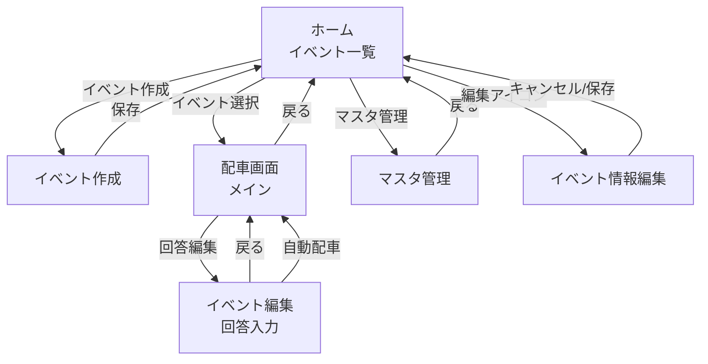
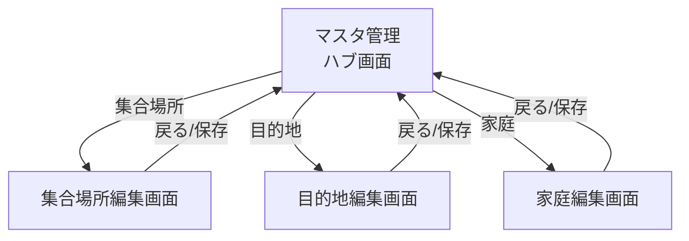

# 1. 目的

配車担当・管理者が実際に使う画面を、実装可能なレベルまで定義する。

---

# 2. アプリ名

**CarpoolBridge**

---

# 3. 設計方針（配車担当の思考順に合わせる）

配車担当は概ね以下の順番で考える（01_現状業務分析・07_配車アルゴリズムと共通）。

```
集合場所ごとに分ける
↓
車を決める
↓
定員確認
↓
方向確認
↓
微調整
```

この思考順に沿って、

「集合場所がひと目に分かる」
→「車カード単位でまとまって見える」
→「ドラッグ＆ドロップで直感的に修正できる」

ことを重視する。

このアプリの最重要価値は、

> 「自動配車」ボタンを押して、80〜90%完成した配車案が10秒程度で出てくること

である。配車担当が一番困っているのは「定員オーバー」と「乗せ忘れ」なので、
この2つは常に画面上で目立たせる。

---

# 4. 画面一覧

1. ホーム（イベント一覧）
2. イベント作成
3. 配車画面（メイン）
4. イベント編集 回答入力
5. マスタ管理
6. イベント情報編集

※ LINE共有は独立した画面ではなく、配車画面（メイン）内のモーダルとして提供する（9章参照）。そのため本一覧には含めない。

## 画面遷移


```mermaid
flowchart TD

A[ホーム<br>イベント一覧]

B[イベント作成]

C[配車画面<br>メイン]

D[イベント編集<br>回答入力]

F[マスタ管理]

G[イベント情報編集]


A -->|イベント選択| C
A -->|イベント作成| B
B -->|保存| A

C -->|戻る| A

C -->|回答編集| D
D -->|戻る| C
D -->|自動配車| C

A -->|マスタ管理| F
F -->|戻る| A

A -->|編集アイコン| G
G -->|キャンセル/保存| A
```

「共有」操作は画面遷移ではなくモーダル表示のため、本図には含めない（9章参照）。

---

# 5. ホーム（イベント一覧）

```
┌─────────────────────────┐
│ CarpoolBridge           │
├─────────────────────────┤
│ ● 7/19(土) 通常練習     ⚙│ ← 本日のイベント（強調表示）／右端が編集アイコン
│ 7/26(日) 公式戦 △△球場  ⚙│
│                           │
│ ▼ 過去のイベント（3件）    │ ← 初期状態は折りたたみ
│                           │
│         [+ イベント作成]   │
└─────────────────────────┘
```

* 日付順の一覧表示とし、曜日も表示する
* 本日のイベントは色やアイコンで強調表示する
* 各カードの右端に、イベント情報（イベント名・日付・場所）を編集するためのアイコンボタンを配置する
  * カード内で縦方向は中央揃え（`align-items: center`）とする
  * カード本文（タップで配車画面へ遷移する領域）とは独立したタップ領域とし、誤タップ防止のため本文との間に十分な余白を設ける
  * タップすると7章「イベント情報編集」画面へ遷移する。回答内容を編集する4章「イベント編集 回答入力」画面とは別の画面であり、混同しないこと
  * カード本文（アイコン以外の部分）をタップした場合の遷移（配車画面へ）は変更しない
* 本日以降のイベントを一覧上部に表示する
* 開催日を過ぎたイベントは初期状態では折りたたみ、「過去のイベント（n件）」の行をタップすると展開する
  * 展開後はグレーアウトして表示する
  * 過去のイベントが0件の場合、この行自体を表示しない
* 本日以降のイベントが0件の場合は「今後の予定はありません」を表示する
* イベントの状態（開催予定・本日・終了）はラベル表示せず、表示スタイルで表現する
* 目的地が削除済みで名称を解決できない場合は、場所欄に「（削除済み）」と表示する（非表示にはしない。05_データ設計.md#11 削除方針）
* タップで配車画面へ遷移する
* 画面下部固定ナビゲーションは置かない

---

# 6. イベント作成

```
┌─────────────────────────┐
│ イベント作成              │
├─────────────────────────┤
│ イベント名                │
│ [__________________]     │
│                          │
│ 日付                     │
│ [2026/07/12]             │
│                          │
│ 目的地                   │
│ ▼ ○○小学校（登録された目的地から選択）│
│                          │
│         [保存]           │
└─────────────────────────┘
```

---

# 7. イベント編集 回答入力

参加有無・車出し・乗車可能人数・特記事項など、イベントに関する回答情報を
まとめて編集する画面。単なる「回答の入力」ではなく、後からいつでも
修正できる「編集」画面として位置づける。

家庭ごとにカードをまとめ、その中に所属する選手（1人〜複数人）の回答を並べる。
LINE返信自体が家庭単位で届くため、入力の単位も家庭に合わせる。

初期表示（画面を開いた直後、全家庭カードが折りたたまれた状態）：

```
┌─────────────────────────┐
│ [<] 7/12(土) 練習試合 [🚗配車]│
│     📍 河川敷グラウンド      │
│ 回答済み2 一部回答0 未回答0 [全て展開] │
├─────────────────────────┤
│ 山田家     [可][選手1/1]  ▶│
├─────────────────────────┤
│ 佐藤家 [行きのみ][選手1/1][コーチ○] ▶│
├─────────────────────────┤
│ 鈴木家           [未回答]  ▶│ ← 全項目未回答（チップ1つに簡略化）
└─────────────────────────┘
```

家庭カードのヘッダー行（山田家など）をタップすると、その家庭だけ展開する：

```
┌─────────────────────────┐
│ 山田家     [可][選手1/1]  ▼│
│  🚗 [可][不可][行きのみ][帰りのみ] │
│  乗車可能人数 [ 5 ]人      │ ← 未変更時は初期値を薄字で表示
│  ─────────────────      │
│  太郎（小6）[選手]          │
│   [○][✕]　行⏻ 帰⏻          │
│  ─────────────────      │
│  花（小3）[選手]            │
│   [○][✕]　行⏻ 帰⏻          │
│  ─────────────────      │
│  山田父 [コーチ]            │
│   [○][✕]                  │
│  ─────────────────      │
│  備考 [______________]  │
├─────────────────────────┤
│ 佐藤家 [行きのみ][選手1/1][コーチ○] ▶│
└─────────────────────────┘
```

- 家庭カードの並び順は、家庭内の選手の最高学年（学年が最も高い子）を基準に降順（6年→1年の順）で並べる。最高学年が同じ家庭同士は家庭名順（文字列比較）とする。対象学年の選手がいない家庭（学年情報を持つ選手が1人もいない場合）は末尾に表示する。
- 備考は家庭単位で入力する。
- 学年を表示する
- 初期値を薄字でプレースホルダー表示する
  当日の荷物等で人数が変動する場合は、担当者が数値を上書き変更できる。変更されると、画面上では通常字＋アイコン等で「変更済み」であることが分かるように表示する
  - 増減はピル型の外枠に丸ボタン（－／＋）を収めたステッパーで行う（数値の手入力はしない）。同じデザインを10章「マスタ管理」家庭編集画面の「通常定員」でも使用し、アプリ全体でステッパーの見た目を統一する
- 「車出し」の行頭は文言を表示せず、車のアイコンで代替する（人カードの「参加」も同様に文言を表示しない。カード内の文脈から自明なため）
- **車出しは「可／不可／行きのみ／帰りのみ」の4択（排他選択）とし、行き・帰りそれぞれの[可][不可]を別々のボタンとしては表示しない。**
  * 内部的にはdriverOutward／driverReturn（05_データ設計.md参照）という独立した2つの項目に対応するが、画面上は次の4通りの組み合わせを1つの選択として提示する：可＝driverOutward/driverReturnとも`true`、不可＝ともに`false`、行きのみ＝driverOutwardのみ`true`、帰りのみ＝driverReturnのみ`true`
  * 未回答時（driverOutward・driverReturnとも`null`）はどのボタンも選択色にならない
  * 乗車可能人数が0人の場合、[不可]以外（[可][行きのみ][帰りのみ]）は選択不可にする（矛盾した回答を防ぐため）
    * 既にいずれかが選択された状態で人数が0になった場合は、選択状態はそのまま維持し、ボタン操作のみ無効にする（値を自動的に書き換えない）
    * [不可]ボタンは人数によらず常に操作可能とする
    * 人数を1以上に戻すと、[可][行きのみ][帰りのみ]ボタンは再び操作可能になる
- 家庭に紐づくコーチが存在する場合のみ、家庭カード内に追加表示する（該当コーチがいない家庭では非表示）。
- カード内に選手ごとの回答（参加・行きの配車不要・帰りの配車不要）を1人ずつ並べる（兄弟が複数人いる家庭でも、1枚のカードで完結する）
- **参加ボタンは3状態とする。**
  * 初期状態では○✕とも未選択状態で表示する
  * 初期状態は未回答とし、○✕どちらのボタンも非選択（グレー表示）とする
  * ○または✕をタップすると該当ボタンが選択色に変わる
  * タップ後も再タップにより○⇔✕の変更は可能
  * 未回答であることのラベル表示（⚠️等）は今回は実装しない
- **「現地集合」「保護者迎え」などの特殊なケース（行きの配車不要・帰りの配車不要）は、チェックボックスではなく行き／帰りそれぞれのミニスイッチ（ON/OFF）で表現する。** それ以外の例外事項は備考欄に入力する
  * スイッチは**ON＝送迎あり（通常）／OFF＝配車不要（例外）**を表す。ONが既定・肯定表現になるようにし、「ONにすると不要になる」という否定的な意味をONに割り当てない
  * 参加を○にした瞬間、行き・帰りのスイッチは自動的に両方ONになる（＝送迎あり）。担当者は現地集合・保護者お迎えなど配車が不要な方向だけを個別にOFFにする
  * 参加が○以外（未回答・✕）の間はスイッチを操作不可にする（○になるまで意味を持たないため）。値自体は保持し、○に戻せば直前の状態が復元される
- 「保存」ボタンは置かない。入力した瞬間に自動保存する（11章の自動保存方針と統一）。
- 「自動配車」ボタンは画面下部までスクロールしなくても押せるよう、ヘッダー右上（タイトル行の右側）に常時表示する。家庭カードが多い場合でもスクロール不要で押せることを優先する。
  * ラベルは幅を抑えるため、車アイコン＋「自動配車」の短縮表示とする
- 戻る操作はヘッダー左の戻るアイコンのみとする（画面下部には配置しない）。押した場合は配車画面へ戻る。回答内容は自動保存されているため、遷移自体が回答内容に影響することはない。なお、配車画面側では車出し可否の変更などが自動整合される場合がある（8章「画面を開いた際の自動整合」参照）。
- 「自動配車」ボタンを押した場合は、最新の回答内容を基に配車を作成し、配車画面へ遷移する。
- 既に配車結果が存在する場合は、現在の配車結果を削除して再作成するか確認ダイアログを表示する。

## 家庭カードの折りたたみ

家庭数が多い場合のスクロール量を減らすため、家庭カードは折りたたみ表示に対応する。

- 家庭カードのヘッダー行（家庭名の行）はタップで開閉できる。ヘッダー行自体が開閉ボタンを兼ね、右端に開閉状態を示す矢印アイコンを表示する。
- ヘッダー（タイトル行）の下に「全て展開／全て折りたたむ」ボタンを常時表示し、全家庭を一括で開閉できる。1つでも折りたたまれている家庭があれば「全て展開」、全家庭が展開済みであれば「全て折りたたむ」と、現在の状態に応じてラベルを自動的に切り替える。
- 画面を開いた直後は、全家庭カードを折りたたんだ状態で表示する。ヘッダー下の集計表示（回答済み／一部回答／未回答）と各家庭のチップだけで全体の状況を把握できるようにし、必要な家庭だけ開いて編集する使い方を基本とする。
- 開閉状態は画面を離れると保持しない。再度開いた際は常に全展開の状態から始まる。

### ヘッダー行のチップ表示

折りたたんでいても状況が一目で分かるよう、家庭名の右側（開閉アイコンの左）に状態チップを表示する。
チップは残り幅いっぱいに左詰めで並び、入りきらない分だけ次の行へ折り返す。

- **車出し**：可／不可／行きのみ／帰りのみ。車出しが未回答の場合は「車出し 未回答」と表示する
- **選手**：「選手 参加人数/総人数」。所属する全選手が回答済みの場合のみ人数を表示し、1人でも未回答なら「選手 未回答」と表示する
- **コーチ**：家庭にコーチが紐づく場合のみ表示する。「コーチ ○／✕」。未回答なら「コーチ 未回答」

家庭の回答状況が「未回答」（判定方法は05_データ設計.md#8「回答状況（回答済み／一部回答／未回答）」参照）の場合は、
上記チップの代わりに「未回答」の1チップのみを表示する（入力が何もないため、項目ごとのチップを並べても情報がないことに変わりないため簡略化する）。

### ヘッダー下の集計表示

タイトル行の下に、対象イベントの全家庭を「回答済み／一部回答／未回答」の3区分で件数集計して表示する
（判定方法は05_データ設計.md#8参照）。

## 配車再作成

既に配車結果が存在する状態で「自動配車」を実行した場合は、確認ダイアログを表示する。

### 確認ダイアログ

**タイトル**

```
配車を再作成
```

**メッセージ**

```
現在の配車結果は削除されます。

回答内容を反映して
配車を再作成しますか？
```

**ボタン**

- キャンセル
- 再作成

「再作成」を選択した場合は、現在の配車結果を削除し、最新の回答内容を基に配車を再作成した後、配車画面へ遷移する。

## 開発用機能（開発環境のみ表示）

### サンプル回答生成

- ボタン名：`サンプル回答生成`
- 配置：画面最下部
- 表示条件：開発環境のみ表示（本番環境では非表示）
- 役割：登録済みの情報を利用し、対象イベントの回答をランダムに生成する。

### 動作

1. ボタン押下時、確認ダイアログを表示する。
2. ユーザーが実行を選択した場合、対象イベントの既存回答を削除する。
3. ランダムな回答を生成・登録する。
4. 完了メッセージを表示する。

※ 回答内容はランダムに生成されるため、実行のたびに結果が変わる。

---

# 8. 配車画面（メイン）

本画面は本アプリのメイン画面である。

ホーム（イベント一覧）でイベントを選択すると本画面へ遷移する。

回答内容を変更する場合はイベント編集画面へ遷移する。
イベント編集画面では回答内容を編集し、必要に応じてイベント編集画面の「自動配車」を実行する。

LINEで共有する場合は共有モーダルを開く（9章参照）。

画面全体を**縦スクロール**とする。

画面は以下の順に表示する。

```
操作ボタン
    ↓
配車サマリー帯（常時表示）
    ↓
未配車
    ↓
車カード
    ↓
車カード
    ↓
車カード
```

1画面ですべての配車状況を確認・編集できる構成とする。

---

## 操作エリア

画面上部に「行き／帰り」の切り替えタブを配置する。
表示される配車結果・未配車・車カード・操作対象は、選択中のタブ（行き／帰り）に応じて切り替わる。

```
┌─────────────────────────┐
│ 配車                     │
├─────────────────────────┤
│ [ 行き ] [ 帰り ]        │
│                          │
│         [回答編集] [共有] │
└─────────────────────────┘
```

## 行き／帰りタブ

- 「行き」「帰り」の2つのタブを表示する
- 初期表示は「行き」とする
- タブ切り替え時は以下をすべて切り替える
  - 未配車一覧
  - 車カード
  - 乗車メンバー
  - 配車結果
- 行きと帰りの配車結果は独立して保持し、片方を編集してももう片方には影響しない

表示する操作は以下とする。

- 回答編集
  - 7章のイベント編集画面へ遷移する。
  - 参加有無・車出し・乗車可能人数・備考などを編集する。
  - 回答は自動保存される。
  - 配車画面を開くと、車出し可否の変更のみ自動整合される（後述「画面を開いた際の自動整合」参照）。それ以外の乗車メンバーの配置は変更されない。
  - 配車結果を全面的に更新する場合は、イベント編集画面の「自動配車」を実行する。
- 共有
  - 共有モーダル（9章参照）を開く。画面遷移は発生しない。
  - 行き・帰り両方向をまとめた共有用画像を対象とする（選択中タブに関わらず、常に両方向が対象になる）。

---

## 画面を開いた際の自動整合

配車画面を開くたびに、選択中の方向に関わらず行き・帰り両方向について、以下を自動的に反映する。確認ダイアログは表示せず、既存の手動調整（乗車メンバーの配置）はできる限り保持する。

- 対象外になった乗車メンバーの除去
  - 回答編集画面での変更により参加対象でなくなった選手・コーチ（欠席に変更、送迎不要に変更等）が、いずれかの車の乗車メンバーに含まれている場合、そのCarpoolのmembersから除去する（結果として未配車として扱われる）。
  - 他の車・他のメンバーの配置には影響しない。
- 車出し可否の変更に応じた車の自動追加・削除
  - 車出し可否が可→不可に変わった家庭の車（Carpool）が存在する場合、そのCarpoolを削除する（乗車していたメンバーは上記と同様に未配車として扱われる）。
  - 車出し可否が不可→可に変わった家庭について、対象方向にその家庭の車がまだ存在しない場合、新規に空の車（乗車メンバーなし）を作成する。定員は`capacityToday`（未設定の場合は`Family.vehicleCapacity`）とする。
  - 対象方向に既にその家庭の車が存在する場合は、重複して作成しない。
  - 「行きのみ」「帰りのみ」への変更は、変化した方向のみを対象とする（例：可→行きのみの場合、帰り方向の車のみ削除する）。
  - この処理は「自動配車」（前述）とは異なり、対象の車以外の乗車メンバー配置は一切変更しない。

---

## 配車サマリー帯

配車担当は小さいスマホ画面でカードを操作しながら考えるため、車カード一覧をスクロールしている間も
全体（各車の乗車率・経由地数・未配車人数）を俯瞰できるよう、行き／帰りタブの直下にサマリー帯を常時表示する。

```
┌─────────────────────────┐
│ 配車                     │
├─────────────────────────┤
│ [ 行き ] [ 帰り ]        │
├─────────────────────────┤
│ 🧍未配車2  🚗鈴木6/5📍2   │
│ 🚗田中3/4📍1 🚗山田2/5📍3 │
│ 🚩配車不要2               │
├─────────────────────────┤
│ (未配車エリア・車カード・  │
│  配車不要エリア)          │
└─────────────────────────┘
```

- 表示位置はヘッダー・行き／帰りタブと一体化し、画面上部に固定表示（sticky）とする。
  ヘッダー・タブ・サマリー帯を1つの固定ブロックとして扱う（人カードのドラッグ操作中もサマリー帯が隠れないようにするため）。
  これに伴い、行き／帰りタブも本サマリー帯と合わせて固定表示に変更する（従来はスクロールに追従して画面外へ流れていた）。
- 表示内容はチップ形式とする。
  - 未配車人数チップ（未配車エリアと同様、未配車が0人の場合は表示しない）
  - 各車チップ（車名・乗車率・経由地数）。表示順は車カードの表示順と同じとする
    - 定員超過の車のチップは、車カードの赤枠表示と同様に赤色で強調する
  - 配車不要人数チップ（後述「配車不要エリア」参照）。表示順は各車チップの後ろとする。配車不要が0人の場合は表示しない。
    未配車人数チップとは異なる控えめな配色・アイコン（🚩）とし、対応が必要な警告ではないことを示す
  - 独立した警告件数チップは設けない。定員超過は各車チップの赤色表示、未配車は未配車人数チップで表現するため、これで十分とする
    （運転者不在の警告は、引き続き画面下部の既存の警告バナー「リアルタイム警告」で表現する。本サマリー帯では扱わない）
- 台数が多い場合でも横スクロールはさせず、折り返し（複数行）で表示する。一目で全車を見渡せることを優先する
- 行き／帰りタブの切り替えに応じて、サマリー帯の内容も連動して切り替わる
- ヘッダー右上のアイコンボタンで、サマリー帯の表示／非表示を切り替えられる
  - 初期状態（画面を開いた直後）は常に「表示」から始まる。非表示にした状態は保存しない（画面を開き直すたびに表示状態にリセットされる）

---

## 未配車エリア

```
┌─────────────────────────┐
│ 未配車　3名              │
├─────────────────────────┤
│ 📍西公園（2人）          │
│ [山田太郎(小4)] [中村父]  │
│ 📍中央公園（1人）        │
│ [石川蒼(小3)]            │
└─────────────────────────┘
```

- 未配車エリアは常に画面最上部へ表示する
- 未配車エリアの枠は点線にする
- 未配車が0人になった場合は自動的に非表示とする
- 人カードはドラッグ＆ドロップ可能とする
- 配車不要（後述「配車不要エリア」参照）に該当する選手は含まない
- 乗車メンバーは所属家庭の集合場所（マスタの集合場所ID）ごとにグルーピングして表示する。詳細は後述「集合場所グルーピング」を参照

---

## 車カード

```
┌─────────────────────────┐
│ 🚗 鈴木号            4/5 │
│ 📍西公園  📍中央公園           │
├─────────────────────────┤
│ 📍西公園（2人）          │
│ [中村父] [山田太郎(小4)] │
│ 📍中央公園（1人）        │
│ [佐藤花子(小2)]          │
└─────────────────────────┘
```

集合場所が1箇所しかない車の場合は、乗車メンバーの集合場所見出しを省略する（車名の横に既に表示されているため）。

```
┌─────────────────────────┐
│ 🚗 渡辺号            2/3 │
│ 📍北公園                │
├─────────────────────────┤
│ [あおい(小1)] [渡辺父]   │
└─────────────────────────┘
```

車カードには以下を表示する。

- 車アイコン
- 車名（家庭名+号)
  - 車名は家庭名から「家」を除いた名称に「号」を付与する（例：山田家→山田号）
- 乗車率（4/5など）
- 経由する集合場所（表示順は巡回順を意味しない。矢印などの順序表現はしない。実際にどの順で回るかは当日ドライバーが判断する。集合場所が削除済みの場合は「（削除済み）」と表示する）
- 乗車メンバー

定員超過の場合はカード枠を赤くする。

### 乗車率の算出について

乗車率の分子（乗車人数）は乗車メンバー数そのものである。運転者分を別途加算することはしない。

---

## 配車不要エリア

参加はするが、その方向（行き／帰り）は送迎が不要（現地集合・保護者お迎え等）と回答されている選手を表示するエリア。
7章の回答編集画面にある「送迎要否」ミニスイッチがOFFの選手が対象。
「送迎要否」スイッチは選手にのみ存在し、コーチには存在しない（コーチの参加有無は`coachParticipating`のみで管理し、方向別の送迎要否の概念を持たない）ため、本エリアの対象は選手のみとする。

```
┌─────────────────────────┐
│ 🚩配車不要　2名           │
│ 現地集合・保護者お迎えなど  │
│ 送迎が不要な参加者です     │
├─────────────────────────┤
│ 🚩木村美咲 (小2) 📍北団地  │
│ 🚩加藤大和 (小6) 📍北団地  │
└─────────────────────────┘
```

- 対象：選択中タブ（行き／帰り）において「参加」かつ、対象方向の送迎要否スイッチがOFF（配車不要）の選手
  - 未回答（参加有無が未選択）・不参加の選手は対象に含めない（未配車エリアと同様、画面上には表示されない）
  - コーチは対象外（コーチには送迎要否スイッチが存在しないため）
- 表示位置：画面最下部（未配車エリア・すべての車カードより後ろ）に表示する
- 見出しの下に、配車不要が何を意味するかの説明文を1行添える（例：「現地集合・保護者お迎えなど、送迎が不要な設定になっている参加者です」）
- エリアの枠は実線とし、見出しの文字色も控えめにする（未配車エリアの点線・濃い見出しとは見た目を区別し、「対応が必要な状態」ではないことを示す）
- 配車不要が0人になった場合は自動的に非表示とする（未配車エリアと同様）
- 人カードはドラッグ＆ドロップの対象外とする（後述「ドラッグ＆ドロップ」参照）。ドラッグハンドル（≡）は表示せず、代わりに🚩アイコンを表示する
- 参加有無・送迎要否の変更は、回答編集画面（7章）でのみ行う。配車画面上に変更手段は設けない
- 本エリアは集合場所グルーピング（後述「集合場所グルーピング」参照）の対象外とする。既存どおり1人1行・カード上に集合場所ラベルを直接表示する形式のままとする（意図的な例外であり、将来ここへグルーピングを広げる予定はない）

---

## リアルタイム警告

配車修正（ドラッグ＆ドロップによる人カードの移動）のたびに、以下をリアルタイムに再判定する（UC-05参照）。

- 定員超過の車がないか
- 運転者不在の車がないか（家庭に参加するコーチが紐づくのに、そのコーチの人カードが自分の家庭の車に含まれていない）
- 未配車の選手・コーチがいないか

問題がある場合は、画面上部に警告バナーを表示する。複数の問題が同時に発生している場合は1つのメッセージにまとめて表示する。

---

## 人カード

人カードはドラッグ可能なカードとして表示する。

```
≡ 山田太郎(小3) [📍xx公園]
```

または

```
≡ 中村父 [📍yy公園]
```

または

```
≡ 田中父 [📍zz小学校]
```

人カードには以下を表示する。

- ドラッグハンドル
- 名前
- 集合場所ラベル

この構成（ドラッグハンドル・名前・集合場所ラベル）は配車不要エリア内の人カードにそのまま適用される。
未配車エリア・車カード内の人カード（次項「集合場所グルーピング」内のチップ）は、集合場所ラベルをカードからは省き、グループ見出し側に1回だけ表示する。

※ 配車不要エリア（前述）内の人カードは例外で、ドラッグハンドルの代わりに🚩アイコンを表示する（ドラッグ＆ドロップ対象外のため）。

### 集合場所グルーピング

未配車エリア・車カード内の乗車メンバーは、1人1行ではなく、所属家庭の集合場所ごとにグルーピングして表示する（配車不要エリアは対象外。前述の通り現状の1人1行のまま）。

- グルーピングの判定基準：所属家庭の集合場所ID（マスタのID）。表示名の文字列比較ではなく、IDで同一性を判定する（表記ゆれによる意図しない分裂を防ぐため）
- 見出し表示：`📍場所名（N人）`
- グループ内の並び順：学年降順（小6→小1）、学年なし（コーチ等）は最後、同学年は名前順（文字列比較）とする。7章の家庭カード並び順と同じ規則
- グループ自体の並び順：`members`配列内での初出順（並び替えのための操作は提供しない。後述「ドラッグ＆ドロップ」内の「挿入位置」参照）
- 1人しかいない集合場所も、同じ見出し＋チップ形式で表示する（一貫性のため、単独カードの特別扱いはしない）
- チップの表示内容：名前＋学年のみ（例：「たろう (小4)」）。集合場所はチップ側には表示せず、見出し側にのみ表示する
- 車カードにおいて集合場所グループが1つしかない場合は、見出しを表示しない（車名の横に経由する集合場所が既に表示されているため、重複表示になる）。未配車エリアはこの例外の対象外とし、常に見出しを表示する（他に集合場所を示す箇所がないため）
- 集合場所が削除済みで名称を解決できない場合は、場所名を「（削除済み）」と表示する（05_データ設計.md#11 削除方針）

---

## ドラッグ＆ドロップ

人カードは

- 未配車エリア
- 各車カード

の間を自由にドラッグ＆ドロップできる。

配車不要エリア（前述）の人カードはドラッグ＆ドロップの対象外とする。参加有無・送迎要否が変わらない限り、車カードへ移動することはない。

ドラッグ可能であることが分かるよう、カード左側にドラッグハンドル（≡）を表示する。

ドラッグ中はドロップ可能な車カードを強調表示し、配置先が分かりやすいUIとする。

長押しでドラッグ開始する。タップやスクロールとドラッグを誤操作なく使い分けられるようにする。

ドラッグの有効な範囲は入力デバイスにより異なる。

- マウス操作：カード全体をドラッグ起点にできる
- タッチ操作：カード上からの縦スクロールを妨げないよう、ドラッグハンドル（≡）部分のみをドラッグ起点とする

### オートスクロール

車の台数が多く一覧が画面に収まらない場合でも、画面外の車カードへ人カードを移動できるようにする。

- ドラッグ中、ポインターが画面（ビューポート）の上端または下端から一定範囲に入っている間、画面を自動的にスクロールする
- 下端側のしきい値は固定値とする
- 上端側のしきい値は、sticky header（ヘッダー・行き帰りトグル・サマリーバー）の実高さに追従する。サマリーバーの表示・非表示でヘッダー全体の高さが変わるため、固定値ではなく実高さを測定し、それに余白を加えた値をしきい値とする（サマリー非表示時はしきい値も小さくなり、より上寄りでオートスクロールが始まる）
- ポインターがしきい値の範囲外に出る、またはドラッグが終了・キャンセルされた時点でスクロールを停止する

### 挿入位置

ドラッグ＆ドロップは、乗車メンバーがどのゾーン（未配車エリア／どの車カード）に属するかのみを変更する操作とする。

- 車カード内の表示順は、前述「集合場所グルーピング」（グループ分け＋学年・名前順）によって常に一意に決まるため、`members`配列内の位置を手動で並べ替える操作は提供しない
- 同一ゾーンへのドロップ（同じ車の中／未配車エリアの中でのドラッグ）は何も変更しない（Firestoreへの書き込みも発生しない）
- 異なるゾーンへのドロップ（未配車エリア → 車カード、車カード → 車カード）は、移動先ゾーンの`members`配列の末尾に追加する（挿入位置の指定はできない）

---

## 色分けルール

- 選手、コーチ、保護者のカードは色分けで区別する
- 所属家庭の集合場所を示すラベルも人のカードに表示する（例：📍西公園）（配車不要エリアの人カードにのみ適用。未配車エリア・車カードでは集合場所はグループ見出し側に表示する。前述「集合場所グルーピング」参照）
- 役割ごとの色は「背景＋枠線＋左帯（カード左端の太い色帯）」の3点セットで表す。文字色は役割によらず共通とし、役割名のテキストラベル（バッジ）は付けない（名前・学年等の表記とカード色のみで判別できるため）
- ダークモードは廃止し、ライトモードのみ提供する

### 定員超過時の扱い

- 定員超過の場合はカード枠を赤くする（既存方針を維持）
- 人カードは未配車エリア・各車カードの間を自由にドラッグ＆ドロップできる。**満員の車カードへのドロップも拒否しない**（乗せすぎ状態になった場合は上記の赤枠表示で警告するのみで、移動操作自体は妨げない）

### ドラッグ＆ドロップの視覚状態

- ドラッグ中の人カード：不透明度を下げて表示する。役割色（背景・枠線）はそのまま維持し、不透明度のみ変える
- ドラッグ中にホバーしているドロップ先（車カード／未配車エリア）：破線の強調枠＋薄い背景を重ねて表示する（役割色を上書きしない）
- 上記のとおり満員車への移動も許可するため、現時点では「ドロップ不可を示す警告色」は使用しない。将来、配置そのものを制限する仕様に変更する場合に備えて予約しておく

### 保護者カードについて（今回スコープ外）

保護者カードの色（背景・枠線・左帯）は用意するが、実際にカードとして表示する機能は今回実装しない。理由：現状のデータ設計（`Family`型・`PersonCardData`）には保護者を表す項目がなく、選手／コーチの2値判定のままである。保護者データ（氏名・参加有無等）を`Family`/`Response`型に追加するデータ設計は将来の別タスクで行う。

---

# 9. LINE共有

配車画面（メイン）の「共有」ボタンを押すと、配車画面の上に共有モーダルが開く。
独立した画面（URL）は持たない。閉じると画面遷移を伴わずに配車画面へ戻る。

## 9.1 モーダルの構成

共有モーダルでは、「行き」「帰り」の配車結果を1枚にまとめた共有用画像をプレビュー表示し、その画像をLINEへ共有できる。
1枚の画像に両方向を表示するため、モーダルに行き／帰りの切り替えタブは設けない（配車画面本体の行き／帰りタブ〈8章〉とは独立しており、影響しない）。

```
┌─────────────────────────┐
│                      ✕  │
│ ┌─────────────────────┐ │
│ │                       │ │
│ │  （共有用画像プレビュー） │ │
│ │                       │ │
│ └─────────────────────┘ │
│                          │
│ [       共有       ]      │
└─────────────────────────┘
```

- モーダルを開くと同時に共有用画像の生成を開始し、生成が完了するまではプレビュー領域にローディング表示を行う
- ✕（閉じる）をタップ、または背景をタップすると、モーダルを閉じて配車画面へ戻る
- 共有ボタンのラベルは「共有」とする（LINE以外のアプリへの共有もOSの共有シート経由で可能なため、「LINEで共有」とは表記しない）

## 9.2 共有用画像の内容

画像は縦1枚とし、以下の順で構成する。

1. 見出し
2. 「行き」セクション
3. 「帰り」セクション

見出しは配車画面（メイン）のヘッダーと同じ考え方で、イベント名を大きく、日付・目的地は小さく薄い文字で1行にまとめて表示する（8章のタイトル欄と同様の情報構成。目的地は`Event.destinationId`から解決した目的地名）。

各方向セクションの見出しには、方向を表す矢印（行き＝→、帰り＝←）を添えたラベルを、画像幅いっぱいの帯で表示する。行きセクションと帰りセクションの間には区切り線を入れる。画像を縦にスクロールして見たときに、どちらの方向の内容かが常に一目で分かるようにするための工夫であり、9.1章の「行き／帰りタブを設けない」方針と矛盾しない（タブの代わりに、両方向を常に見分けられるラベルで表現する）。

各セクションの中身（車カード・未配車エリア・配車不要エリア）は、配車画面（メイン、8章）の該当タブと同じ表示仕様をそのまま用いる。ただし以下のとおりとする。

- ドラッグハンドル（≡）など操作専用のUI要素は表示しない（画像はあくまで静的な表示専用とする）
- 未配車エリア・配車不要エリアは、対象が1人もいない場合は表示しない（8章と同じ扱い）
- サマリー帯・警告バナーなど、配車画面上の操作補助表示は含めない
- 車の台数が多くても画像が縦に長くなりすぎないよう、車カード・未配車エリアの余白（内側のパディング・要素間の間隔）は8章の配車画面本体より詰めた表示にする

## 9.3 共有方法

「共有」ボタンを押すと、画像を添付した状態でOSの共有シート（Web Share API）を開く。利用者は共有シートからLINEを選び、送信する。

「共有」ボタンの押下自体を新たなユーザー操作として扱うことで、Web Share APIの呼び出しが画像生成の待ち時間によって無効化される問題を避ける（画像生成はモーダルを開いた時点で開始し、ボタンが押される頃には完了させておく。9.1章参照）。

画像ファイルの共有に対応していない環境では、画像をダウンロードさせたうえで「ダウンロードした画像をLINEに添付して送信してください」という案内文を表示する（フォールバック）。

---
# 10. マスタ管理

マスタデータ（集合場所・目的地・家庭）の登録・編集を行う画面群。以下の4画面で構成する。

- マスタ管理（ハブ画面）：集合場所・目的地・家庭への入口となるメニュー画面
- 集合場所編集画面
- 目的地編集画面
- 家庭編集画面（所属する選手を含む）

いずれも独立した画面（独立したURL）とし、集合場所・目的地・家庭それぞれの編集・保存はハブ画面を介さず画面単位で完結する。

## 画面遷移（マスタ管理内）


```mermaid
flowchart TD
F[マスタ管理<br>ハブ画面]
F1[集合場所編集画面]
F2[目的地編集画面]
F3[家庭編集画面]

F -->|集合場所| F1
F1 -->|戻る/保存| F

F -->|目的地| F2
F2 -->|戻る/保存| F

F -->|家庭| F3
F3 -->|戻る/保存| F
```

## 10.1 マスタ管理（ハブ画面）

```
┌─────────────────────────┐
│ マスタ管理              │
├─────────────────────────┤
│ 📍 集合場所         6件 >│
├─────────────────────────┤
│ 🏁 目的地           2件 >│
├─────────────────────────┤
│ 🏠 家庭            18件 >│
├─────────────────────────┤
│      [開発用機能...]     │
└─────────────────────────┘
```

- 集合場所・目的地・家庭それぞれの編集画面への入口のみを表示するメニュー画面とする。この画面自体に編集項目・保存操作はない
- 各行には登録件数を表示する（集合場所・目的地は登録件数、家庭は家庭数。選手の人数は表示しない）
- 各行タップで対応する編集画面へ遷移する
- 各行アイコンの背景色は行ごとに変える（集合場所＝青、目的地＝緑）。家庭は選手・コーチのような役割色を持たないため、色を持たないニュートラルな背景にする（白一色になりがちな画面に区別点を作るための配色であり、8章「色分けルール」の役割色とは別の意味づけ）
- 開発用機能（サンプルデータ投入）はこの画面に配置する（詳細は本章末尾「開発用機能」を参照）

## 10.2 集合場所編集画面

```
┌─────────────────────────┐
│ < 集合場所 6件      [保存]│
├─────────────────────────┤
│ 📍 西明石駅               │
│    緯度 34.xxx・経度134.xxx>│
├─────────────────────────┤
│ 📍 大久保公園          ﹀ │  ← タップで展開
│    名称   [__________]   │
│    緯度   [______]       │
│    経度   [______]       │
│                  [削除]   │
├─────────────────────────┤
│         [+ 集合場所を追加] │
└─────────────────────────┘
```

- 登録済みの集合場所の一覧表示・編集・追加を行う
- 各行は折りたたみ表示とする。通常は「名称＋緯度・経度」を1行で表示し、タップした行だけ名称・緯度・経度の編集欄を展開する（多数の集合場所を1画面に収めるため）
  - 展開時の各項目はラベルを入力欄の左に横並びで配置し、縦幅を抑える
  - 新規追加した行は、追加した直後は展開状態で表示する（そのまま入力できるようにするため）
- 一覧末尾の点線行（[+ 集合場所を追加]）で集合場所を追加できる
- 展開した行の末尾に「削除」ボタンを配置する
  - タップすると確認ダイアログ（後述）を表示し、「削除」が選択された場合のみFirestoreへ即時反映する（画面共通の「保存」ボタンとは独立した操作であり、保存の有無に関わらず即削除される）
  - 家庭（`Family.pickupLocationId`）から参照中でも削除できる（参照有無は確認しない。05_データ設計.md#11 削除方針）

### 削除確認ダイアログ（集合場所・目的地共通）

**タイトル**

```
集合場所を削除
```

（目的地編集画面では「目的地を削除」とする）

**メッセージ**

```
本当に削除しますか？
```

**ボタン**

- キャンセル
- 削除

## 10.3 目的地編集画面

```
┌─────────────────────────┐
│ < 目的地 2件        [保存]│
├─────────────────────────┤
│ 🏁 明石球技場              │
│    緯度 34.xxx・経度134.xxx>│
├─────────────────────────┤
│         [+ 目的地を追加] │
└─────────────────────────┘
```

10.2の集合場所編集画面と同様の構成・仕様とする（対象データが目的地に変わるのみ）。折りたたみ行のアイコン背景色も10.1のハブ画面に合わせる（目的地＝緑）。展開行末尾の「削除」ボタン・確認ダイアログの仕様も10.2と同様とする（イベントから参照中でも削除できる）。

## 10.4 家庭編集画面

```
┌─────────────────────────┐
│ < 家庭 18件         [保存]│
├─────────────────────────┤
│ 🏠 山田家  選手1名・西明石駅 [在籍中]>│
├─────────────────────────┤
│ 🏠 佐藤家  選手2名・大久保公園 [在籍中] ﹀│ ← タップで展開
│    家庭名   [__________]        │
│    集合場所 ▼大久保公園          │
│    通常定員 (－) 3 (＋) 人       │
│    在籍中   [●========]         │
│  ┌───────────────────┐         │
│  │👤コーチ [__________]│         │  ← コーチ色のボックス
│  └───────────────────┘         │
│    選手 2名                     │
│  ┌───────────────────┐         │
│  │👤[________]▼学年   [====●]│ │  ← 選手色のボックス（在籍中）
│  └───────────────────┘         │
│                   [+ 選手を追加] │
├─────────────────────────┤
│         [+ 家庭を追加] │
└─────────────────────────┘
```

- 登録済みの家庭・所属する選手の一覧表示・編集・追加を行う
- 各家庭は折りたたみ表示とする。通常は「家庭名・選手人数・集合場所・在籍状態」のみを1行で表示し、タップした家庭だけ詳細編集欄を展開する（家庭数が多くても1画面で見渡せるようにするため）
  - 新規追加した家庭は、追加した直後は展開状態で表示する
- 家庭カードの並び順は、以下の優先順位で並べる
  1. 在籍中の家庭を先、休会中の家庭を後にする
  2. 家庭内の選手の最高学年（学年が最も高い子）を基準に降順（6年→1年の順）で並べる（7章「イベント編集 回答入力」の家庭カード並び順と同じ基準。対象学年の選手がいない家庭は末尾に表示する）
  3. 上記が同じ場合は家庭名順（文字列比較）とする
  - 並び順は画面表示時（保存後の再表示を含む）に決定し、編集中の入力・トグル操作では並び替えない（入力中に一覧の位置が動いて操作しづらくなることを防ぐため）。新規追加した家庭は保存前は一覧末尾に留まる
- [+]ボタンで以下を追加できる
  - 家庭（一覧末尾の点線行。色を持たないニュートラルな見た目とする）
  - 選手（家庭カード内の点線行。選手色＝黄土色のニュートラルな見た目とする）
- 家庭ごとに集合場所を設定する
- 選手・コーチは所属家庭の集合場所を常に使用する（選手ごとの個別設定はできない）
- 家庭・選手は「在籍中」トグルで有効／無効を切り替えられる
  - 無効の家庭・選手は新規イベントの回答・配車対象から除外する
  - 「在籍中」はON/OFFの文言ボタンではなく、iOS風のトグルスイッチ（ON＝緑、OFF＝グレー、文言は表示しない）で切り替える
  - 「通常定員」は数値の手入力ではなく、ピル型・丸ボタンの±ステッパーで増減する（7章「イベント編集 回答入力」の乗車可能人数と同じデザインに統一する）
  - 「通常定員」と「在籍中」は意味の異なる項目のため、横並びにせず行を分けて縦に並べる
  - 折りたたみ行の在籍状態バッジは、OFF時も文言は「在籍中」のまま変えず、色のみグレーアウトする。休会・卒業など無効化の理由を区別する機能ではなく、あくまで「在籍中」トグルの現在値を示すだけであるため、文言は変えない
- 選手の「名前」と「入学年度」は横並びで表示する（どちらも幅を必要としない項目のため）
- 選手・コーチは8章「色分けルール」と同じ役割色（背景＋枠線＋左帯）のボックスで表示する（選手＝黄土色、コーチ＝青灰色）。コーチ名は家庭内の1テキスト項目としてではなく、独立したコーチ用ボックスとして表示する（コーチが未登録の家庭では空欄のまま表示する。入力方法自体は変更しない）
  - 家庭カード自体（外枠）は色を持たないニュートラルな枠とする。7章の回答編集画面の家庭カードと同じ見た目にする。`--parent-*`の紫は「家庭」という単位の色ではなく、将来の保護者個人カード用に予約された色であるため使わない（8章「保護者カードについて（今回スコープ外）」参照）
- 集合場所の選択肢は画面表示時点の登録済みデータを使用する（他画面で新しく追加した集合場所を使いたい場合は、先に集合場所編集画面で保存してからこの画面を開く）

## 共通仕様（集合場所・目的地・家庭編集画面）

- 集合場所・目的地の緯度経度は手入力
- 「保存」ボタンは意図的に用意している
  - 画面内の編集・追加操作はその場でFirestoreへ反映せず、保存ボタン押下時にその画面の内容をまとめて確定する（画面単位の一括確定。他の画面の編集内容は巻き込まない）
  - 保存に成功した場合、ハブ画面へは自動遷移せず同じ画面に留まり、保存後の最新データを再表示する
  - 未保存の編集・追加がある状態で「戻る」を押した場合、確認ダイアログを表示する（誤操作による破棄を防止する）
    - 確認ダイアログで「戻る」を選択した場合のみ、編集・追加内容を破棄してハブ画面へ戻る
    - 未保存の変更がない場合は確認ダイアログを表示せず、そのままハブ画面へ戻る

### 未保存確認ダイアログ

**タイトル**

```
保存されていません
```

**メッセージ**

```
編集内容は保存されていません。
このまま戻ると内容は破棄されます。
```

**ボタン**

- 編集を続ける
- このまま戻る

## 開発用機能（開発環境のみ表示）

マスタ管理（ハブ画面）の最下部に開発支援用の操作エリアを配置する。

### サンプルデータ投入

- ボタン名：`サンプルデータ投入`
- 配置：マスタ管理（ハブ画面）最下部
- 表示条件：開発環境のみ表示（本番環境では非表示）
- 役割：評価・動作確認用のサンプルデータを登録する。

登録対象は全項目。

### 動作

1. ボタン押下時、確認ダイアログを表示する。
2. ユーザーが実行を選択した場合、既存データを全削除する。
3. サンプルデータを登録する。
4. 完了メッセージを表示する。

### 確認ダイアログ

**タイトル**

```
サンプルデータを投入
```

**メッセージ**

```
既存のデータはすべて削除されます。
サンプルデータを投入しますか？
```

**ボタン**

- キャンセル
- 実行

※ 本機能は開発効率向上を目的とした機能であり、一般利用者向け機能ではない。


---

# 11. 保存・全般仕様

- 配車品質スコアのような数値表示は行わない（担当者の総合判断を尊重する）
- ダークモード対応は不要

---

# 12. イベント情報編集

5章「ホーム（イベント一覧）」の各カードにある編集アイコンから遷移する画面。
イベントの基本情報（イベント名・日付・場所）のみを編集する画面であり、
7章「イベント編集 回答入力」（回答内容の編集）とは別の画面である。

```
┌─────────────────────────┐
│ ← イベント情報を編集       │
├─────────────────────────┤
│ イベント名                │
│ [__________________]     │
│                          │
│ 日付                     │
│ [2026/07/12]             │
│                          │
│ 場所                     │
│ ▼ ○○小学校（登録された目的地から選択）│
│                          │
│  [キャンセル]      [保存]  │
│                          │
│      [イベントを削除]     │
└─────────────────────────┘
```

* ヘッダーは戻る矢印＋見出し「イベント情報を編集」とする
* 入力項目はイベント名・日付・場所（目的地）の3つのみとし、既存値を初期表示する。他の項目は追加しない
* 各項目は6章「イベント作成」画面と同じ入力形式（イベント名: テキスト入力、日付: 日付入力、場所: 登録済み目的地からの選択）とする
* 時刻は編集対象としない（Eventは開催日のみを保持し、時刻を保持しないため。05_データ設計.md参照）
* フッターは「キャンセル」「保存」ボタンを横並び・幅均等で配置する
  * キャンセル：変更を破棄してホーム（イベント一覧）へ戻る
  * 保存：Eventドキュメントの該当フィールド（イベント名・日付・目的地）のみを更新し、ホーム（イベント一覧）へ戻る。一覧のカード表示は保存後すぐに反映する
* 「キャンセル」「保存」の下に「イベントを削除」ボタンを危険操作として独立配置する
  * タップすると確認ダイアログ（後述）を表示し、「削除」が選択された場合のみ実行する
  * 対象イベントと、配下の回答（Response）・配車結果（Carpool、行き・帰り両方向）を削除し、ホーム（イベント一覧）へ戻る（05_データ設計.md#11 削除方針）
  * 削除後の復元手段は用意しない

### イベント削除確認ダイアログ

**タイトル**

```
イベントを削除
```

**メッセージ**

```
本当に削除しますか？
回答・配車結果も削除されます。
```

**ボタン**

- キャンセル
- 削除
* 回答（Response）データには一切影響しない
