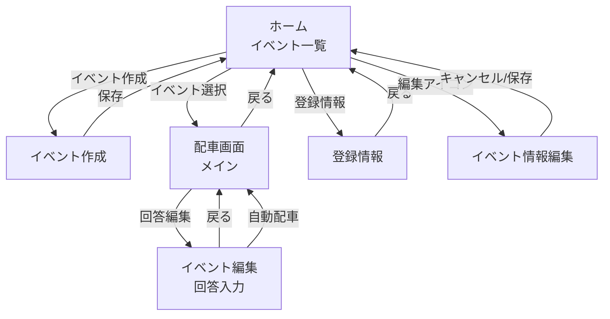
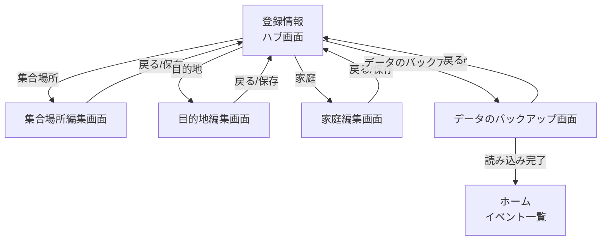

# 1. 目的

配車担当・管理者が実際に使う画面を、実装可能なレベルまで定義する。

---

# 2. アプリ名

**CarpoolBridge**

プロダクト名・リポジトリ名として使用する（README、開発ドキュメント等）。

ユーザーに見せる表示名（画面上のUI文言、ブラウザのタブタイトル＝`index.html`のtitleタグを含む）は**配車アシスタント**とする。
本設計書の画面イメージ内でアプリ名テキストを表示する箇所は「配車アシスタント」と表記する。

---

# 3. 設計方針（配車担当の思考順に合わせる）

配車担当は概ね以下の順番で考える（01_現状業務分析・07_配車アルゴリズムと共通）。

```
集合場所ごとに分ける
↓
車を決める
↓
定員確認
↓
方向確認
↓
微調整
```

この思考順に沿って、

「集合場所がひと目に分かる」
→「車カード単位でまとまって見える」
→「ドラッグ＆ドロップで直感的に修正できる」

ことを重視する。

このアプリの最重要価値は、

> 「自動配車」ボタンを押して、80〜90%完成した配車案が10秒程度で出てくること

である。配車担当が一番困っているのは「定員オーバー」と「乗せ忘れ」なので、
この2つは常に画面上で目立たせる。

---

# 4. 画面一覧

1. ホーム（イベント一覧）
2. イベント作成
3. 配車画面（メイン）
4. イベント編集 回答入力
5. 登録情報
6. イベント情報編集

※ LINE共有は独立した画面ではなく、配車画面（メイン）内のモーダルとして提供する（9章参照）。そのため本一覧には含めない。

## 画面遷移


```mermaid
flowchart TD

A[ホーム<br>イベント一覧]

B[イベント作成]

C[配車画面<br>メイン]

D[イベント編集<br>回答入力]

F[登録情報]

G[イベント情報編集]


A -->|イベント選択| C
A -->|イベント作成| B
B -->|保存| A

C -->|戻る| A

C -->|回答編集| D
D -->|戻る| C
D -->|自動配車| C

A -->|登録情報| F
F -->|戻る| A

A -->|編集アイコン| G
G -->|キャンセル/保存| A
```

「共有」操作は画面遷移ではなくモーダル表示のため、本図には含めない（9章参照）。

---

# 5. ホーム（イベント一覧）

```
┌─────────────────────────┐
│ 配車アシスタント         │
├─────────────────────────┤
│ ● 7/19(土) 通常練習     ⚙│ ← 本日のイベント（強調表示）／右端が編集アイコン
│ 7/26(日) 公式戦 △△球場  ⚙│
│                           │
│ ▼ 過去のイベント（3件）    │ ← 初期状態は折りたたみ
│                           │
│         [+ イベント作成]   │
└─────────────────────────┘
```

* 日付順の一覧表示とし、曜日も表示する
* 本日のイベントは色やアイコンで強調表示する
* 各カードの右端に、イベント情報（イベント名・日付・場所）を編集するためのアイコンボタンを配置する
  * カード内で縦方向は中央揃え（`align-items: center`）とする
  * カード本文（タップで配車画面へ遷移する領域）とは独立したタップ領域とし、誤タップ防止のため本文との間に十分な余白を設ける
  * タップすると7章「イベント情報編集」画面へ遷移する。回答内容を編集する4章「イベント編集 回答入力」画面とは別の画面であり、混同しないこと
  * カード本文（アイコン以外の部分）をタップした場合の遷移（配車画面へ）は変更しない
* 本日以降のイベントを一覧上部に表示する
* 開催日を過ぎたイベントは初期状態では折りたたみ、「過去のイベント（n件）」の行をタップすると展開する
  * 展開後はグレーアウトして表示する
  * 過去のイベントが0件の場合、この行自体を表示しない
  * n件の件数はFirestoreの集計クエリ（件数のみ取得）で表示し、一覧展開前にドキュメント本体は取得しない
  * 展開時、過去のイベントは開催日が新しい順（今日に近い順）に20件だけ取得して表示する。上部（今後の予定）が開催日の古い順であるのに対し、過去のイベントのみ新しい順になる点に注意（直近の過去から遡って確認するユースケースを優先するため）
  * 20件のリストの末尾に「もっと見る」ボタンを表示し、タップするたびに次の20件を追加取得して末尾に追加表示する（全件取得済みの場合はボタンを表示しない）
  * 一度取得したページは折りたたんでも保持し、再展開時に再取得しない
* 本日以降のイベントが0件の場合は「今後の予定はありません」を表示する
* イベントの状態（開催予定・本日・終了）はラベル表示せず、表示スタイルで表現する
* 目的地が削除済みで名称を解決できない場合は、場所欄に「（削除済み）」と表示する（非表示にはしない。05_データ設計.md#12 削除方針）
* タップで配車画面へ遷移する
* 画面下部固定ナビゲーションは置かない

## 5.1 初回利用ガイド（チュートリアル）

staffUsers登録済みユーザーが、この端末でホーム画面を初めて開いたときにのみ、
ホーム画面の上にモーダルで表示する。基本操作の流れだけを簡潔に紹介する。

```
┌─────────────────────────┐
│                  スキップ │
│                          │
│         [ 📋 ]           │
│                          │
│   集合場所・目的地・家庭を  │
│        登録              │
│  「登録情報」から、送迎に  │
│  使う場所とご家庭の情報を  │
│  先に用意します。          │
│                          │
│        ● ○ ○ ○ ○ ○       │
│                          │
│  [戻る]      [ 次へ ]     │
└─────────────────────────┘
```

### 表示条件・判定方法

* staffUsers登録済みユーザーが対象（未登録時の利用申請画面とは無関係。3章「初回アクセス」と用語が紛らわしいため、本ガイドは「初回利用ガイド」と呼び分ける）
* 判定はこの端末のlocalStorageに保存したフラグで行う（Firestoreには保存しない）
  * 端末・ブラウザ単位の判定であるため、別端末やブラウザデータ削除後は再度表示され得る。MVPでは許容する
* フラグが立っていない場合のみ、ホーム画面表示時に自動でモーダルを開く

### 操作

* 「次へ」で次のステップへ進む。最終ステップのみボタン文言を「はじめる」にする
* 「戻る」で前のステップに戻る（1ステップ目では非表示）
* 右上「スキップ」でいつでも閉じられる
* 「はじめる」「スキップ」のどちらで閉じても同じ扱いとする。フラグを立てて閉じ、以後は自動表示しない

### 再表示

一度閉じた後も、ホーム画面から手動で同じ内容を見返せるようにする。

```
┌─────────────────────────┐
│ 🚙 イベント一覧      ？ ⚙登録情報│
├─────────────────────────┤
```

* ホーム画面ヘッダー右側、「登録情報」ボタンの左に、？（ヘルプ）アイコンのみの丸ボタンを常時表示する
* タップすると、初回表示時と同じ内容のモーダルを1ステップ目から表示する
* 閉じ方（スキップ／最終ステップ「はじめる」）・表示内容は5.1の初回表示と同じ
* 手動での表示・終了は、初回表示要否を判定するlocalStorageのフラグに影響しない（すでにフラグが立っている状態を維持するだけで、フラグが立っていない状態には戻さない）

### ステップ内容（6ステップ）

1. 集合場所・目的地・家庭を登録 — 「登録情報」から送迎に使う情報を用意する
2. イベントを選ぶ／作る — ホーム画面から練習・試合を選ぶ
3. 家庭ごとに回答 — 参加・車出し・乗車人数を入力する
4. 配車案を自動作成 — 「自動配車」ボタンで案が数秒で完成する
5. 足りないところは手直し — カードをドラッグして車の間で移動できる
6. 画像にして共有 — できた配車表を画像にして、LINEなどへ送る

### あえて含めない事項

以下は基本操作の範囲外として、本ガイドでは触れない（各画面の案内・操作感に任せる）。

* 行き／帰りが別配車である、という前提そのものの説明
* 定員超過・未配車の警告表示の見方
* 配車不要（現地集合・保護者お迎え）の扱い
* 配車の再作成／行き⇔帰りコピーなどの応用操作
* 登録情報の各画面の詳しい入力方法
* イベント情報編集（あとから日付・場所を直せること）

---

# 6. イベント作成

```
┌─────────────────────────┐
│ イベント作成              │
├─────────────────────────┤
│ イベント名                │
│ [__________________]     │
│                          │
│ 日付                     │
│ [2026/07/12]             │
│                          │
│ 目的地                   │
│ ▼ ○○小学校（登録された目的地から選択）│
│                          │
│         [保存]           │
└─────────────────────────┘
```

---

# 7. イベント編集 回答入力

参加有無・車出し・乗車可能人数・特記事項など、イベントに関する回答情報を
まとめて編集する画面。単なる「回答の入力」ではなく、後からいつでも
修正できる「編集」画面として位置づける。

家庭ごとにカードをまとめ、その中に所属する選手（1人〜複数人）の回答を並べる。
LINE返信自体が家庭単位で届くため、入力の単位も家庭に合わせる。

初期表示（画面を開いた直後、全家庭カードが折りたたまれた状態）：

```
┌─────────────────────────┐
│ [<] 7/12(土) 練習試合 [🚗配車]│
│     📍 河川敷グラウンド      │
│ 回答済み2 一部回答0 未回答0 [全て展開] │
├─────────────────────────┤
│ 山田家     [可][選手1/1][家族1/1]  ▶│
├─────────────────────────┤
│ 佐藤家 [行きのみ][選手1/1][コーチ1/1] ▶│
├─────────────────────────┤
│ 鈴木家           [未回答]  ▶│ ← 全項目未回答（チップ1つに簡略化）
└─────────────────────────┘
```

家庭カードのヘッダー行（山田家など）をタップすると、その家庭だけ展開する：

```
┌─────────────────────────┐
│ 山田家     [可][選手1/1][家族1/1]  ▼│
│  🚗 [不可][行きのみ][帰りのみ][可] │
│  乗車可能人数 [ 5 ]人      │ ← 未変更時は初期値を薄字で表示
│  ─────────────────      │
│  太郎（小6）[選手]          │
│   [✕][○]　行⏻ 帰⏻          │
│  ─────────────────      │
│  花（小3）[選手]            │
│   [✕][○]　行⏻ 帰⏻          │
│  ─────────────────      │
│  山田父 [コーチ]            │
│   [✕][○]　行⏻ 帰⏻          │
│  ─────────────────      │
│  山田花子 [家族]            │
│   [✕][○]　行⏻ 帰⏻          │
│  ─────────────────      │
│  備考 [______________]  │
├─────────────────────────┤
│ 佐藤家 [行きのみ][選手1/1][コーチ1/1] ▶│
└─────────────────────────┘
```

（コーチが複数人いる家庭では、上記「山田父」の行と同じ形式の行を人数分縦に並べる。）

- 家庭カードの並び順は、家庭内の選手の最高学年（学年が最も高い子）を基準に降順（6年→1年の順）で並べる。最高学年が同じ家庭同士は家庭名順（文字列比較）とする。対象学年の選手がいない家庭（学年情報を持つ選手が1人もいない場合）は末尾に表示する。
- 備考は家庭単位で入力する。
- 学年を表示する
- 初期値を薄字でプレースホルダー表示する
  当日の荷物等で人数が変動する場合は、担当者が数値を上書き変更できる。変更されると、画面上では通常字＋アイコン等で「変更済み」であることが分かるように表示する
  - 増減はピル型の外枠に丸ボタン（－／＋）を収めたステッパーで行う（数値の手入力はしない）。同じデザインを10章「登録情報」家庭編集画面の「通常定員」でも使用し、アプリ全体でステッパーの見た目を統一する
- 「車出し」の行頭は文言を表示せず、車のアイコンで代替する（人カードの「参加」も同様に文言を表示しない。カード内の文脈から自明なため）
- **車出しは「可／不可／行きのみ／帰りのみ」の4択（排他選択）とし、行き・帰りそれぞれの[可][不可]を別々のボタンとしては表示しない。**
  * 内部的にはdriverOutward／driverReturn（05_データ設計.md参照）という独立した2つの項目に対応するが、画面上は次の4通りの組み合わせを1つの選択として提示する：可＝driverOutward/driverReturnとも`true`、不可＝ともに`false`、行きのみ＝driverOutwardのみ`true`、帰りのみ＝driverReturnのみ`true`
  * 未回答時（driverOutward・driverReturnとも`null`）はどのボタンも選択色にならない
  * ボタンの並び順は「不可」→「行きのみ」→「帰りのみ」→「可」とする。左＝送迎負担なし、右＝送迎負担フルという段階的な並びにし、行き・帰りのミニスイッチ（ON＝送迎あり＝右側）と同じ「肯定＝右」の向きに揃える
  * 乗車可能人数が0人の場合、[不可]以外（[可][行きのみ][帰りのみ]）は選択不可にする（矛盾した回答を防ぐため）
    * 既にいずれかが選択された状態で人数が0になった場合は、選択状態はそのまま維持し、ボタン操作のみ無効にする（値を自動的に書き換えない）
    * [不可]ボタンは人数によらず常に操作可能とする
    * 人数を1以上に戻すと、[可][行きのみ][帰りのみ]ボタンは再び操作可能になる
- 家庭にコーチが1人以上登録されている場合のみ、コーチの回答欄を家庭カード内に追加表示する（登録されていない家庭では非表示）。表示内容・操作方法（3状態の参加ボタン＋行き・帰りの送迎要否ミニスイッチ）は選手・家族と同じとする。コーチが複数人いる場合は家族と同様に1人ずつ縦に並べる。表示順は登録順とする（学年のような属性による自動ソートは行わない）。
- 家庭に家族（選手・コーチ以外で配車の対象になり得る人。兄弟・祖父母など）が1人以上登録されている場合のみ、家族の回答欄を家庭カード内に追加表示する（登録されていない家庭では非表示）。表示内容・操作方法（3状態の参加ボタン＋行き・帰りの送迎要否ミニスイッチ）はコーチの回答欄と同じとする。家族が複数人いる場合はコーチと同様に1人ずつ縦に並べる。表示順は登録順とする（学年のような属性による自動ソートは行わない）。
- カード内に選手ごとの回答（参加・行きの配車不要・帰りの配車不要）を1人ずつ並べる（兄弟が複数人いる家庭でも、1枚のカードで完結する）
- **参加ボタンは3状態とする。**
  * ボタンの並び順は「不参加」→「参加」（✕→○）とする。行き・帰りのミニスイッチ（ON＝右側）と同じ「肯定＝右」の向きに揃える
  * 初期状態では○✕とも未選択状態で表示する
  * 初期状態は未回答とし、○✕どちらのボタンも非選択（グレー表示）とする
  * ○または✕をタップすると該当ボタンが選択色に変わる
  * タップ後も再タップにより○⇔✕の変更は可能
  * 未回答であることのラベル表示（⚠️等）は今回は実装しない
- **「現地集合」「保護者迎え」などの特殊なケース（行きの配車不要・帰りの配車不要）は、チェックボックスではなく行き／帰りそれぞれのミニスイッチ（ON/OFF）で表現する。選手・コーチ・家族ともに同じ方式とする。** それ以外の例外事項は備考欄に入力する
  * スイッチは**ON＝送迎あり（通常）／OFF＝配車不要（例外）**を表す。ONが既定・肯定表現になるようにし、「ONにすると不要になる」という否定的な意味をONに割り当てない
  * 参加を○にした瞬間、行き・帰りのスイッチは自動的に両方ONになる（＝送迎あり）。担当者は現地集合・保護者お迎えなど配車が不要な方向だけを個別にOFFにする
  * 参加が○以外（未回答・✕）の間はスイッチを操作不可にする（○になるまで意味を持たないため）。値自体は保持し、○に戻せば直前の状態が復元される
- 「保存」ボタンは置かない。入力した瞬間に自動保存する（11章の自動保存方針と統一）。
- 「自動配車」ボタンは画面下部までスクロールしなくても押せるよう、ヘッダー右上（タイトル行の右側）に常時表示する。家庭カードが多い場合でもスクロール不要で押せることを優先する。
  * ラベルは幅を抑えるため、車アイコン＋「自動配車」の短縮表示とする
- 戻る操作はヘッダー左の戻るアイコンのみとする（画面下部には配置しない）。押した場合は配車画面へ戻る。回答内容は自動保存されているため、遷移自体が回答内容に影響することはない。なお、配車画面側では車出し可否の変更などが自動整合される場合がある（8章「画面を開いた際の自動整合」参照）。
- 「自動配車」ボタンを押した場合は、最新の回答内容を基に配車を作成し、配車画面へ遷移する。
- 既に配車結果が存在する場合は、現在の配車結果を削除して再作成するか確認ダイアログを表示する。

## 一時参加者の追加（今回だけ参加する人）

あらかじめ家族として登録されていない人（普段は配車の対象にならない祖父母・親戚など）が
その回答限りで同乗する場合、登録情報画面へ遷移せず、家庭カードから直接追加できる。

各家庭カードの回答欄（選手・コーチ・家族の並びの末尾）に、点線の追加行
「＋ 今回だけ参加する人を追加」を常時表示する（10章「登録情報」の
「＋ 家族を追加」と同じ見た目・トーンとする）。

タップすると、その場に入力フォームを展開する。

- 名前（自由入力、必須）
- 今後の扱い（「今回限り」／「家族として登録して今後も使う」の2択。初期選択は「今回限り」）
  - どちらを選んでも、紐づけ先の家庭は選択させない。常に「追加操作を行った、そのカードの家庭」に紐づける（別の家庭を選ぶ導線は設けない）

集合場所は選択させず、常に追加操作を行った家庭の集合場所（`Family.pickupLocationId`）を
自動的に使用する（他の選手・コーチ・家族と同じ扱い。05_データ設計.md#9参照）。

「追加する」を押すと、その場で参加が確定する。他の選手・コーチ・家族と異なり
「未回答」の状態を経由せず、参加○・行き帰りとも送迎ありの状態で作成される。
以降は他のメンバーと同じ○✕ボタン・送迎要否ミニスイッチで調整できる。

### 「今回限り」を選んだ場合

FamilyMember（`familyMembers`コレクション）には保存せず、対象家庭のResponseドキュメント内
（`temporaryParticipants[]`）にのみ保持する（05_データ設計.md#9参照）。イベントを
削除すれば、他の回答内容と同様に自動的に削除される。

人カードの色・構成は既存の「家族」と完全に同じ（紫色の背景＋枠線＋左帯、役割名は
「家族」と表示する。専用の色は設けない。8章「家族カードについて」参照）。

見分けが付かないと配車担当が誤って重複入力してしまう恐れがあるため、回答編集画面の
この行にのみ、家族色を流用した小さな「今回限り」バッジを表示する（配車画面側の
人カードには表示しない。8章の人カードは家族と完全に同一の見た目とする）。

在籍中トグルの概念がないため、行の右側に取り消し（×）ボタンを表示し、誤って
追加した場合はその場で削除できるようにする（FamilyMemberとして登録されていないため、
削除の確認ダイアログは不要）。

### 「家族として登録して今後も使う」を選んだ場合

家庭に紐づく`FamilyMember`として新規作成する（10.4 家庭編集画面から追加する場合と
同じ登録内容）。同時に、今回のイベントの参加も自動的に確定させる
（`Response.familyMembers[]`へ反映する）。

追加後は通常の家族と全く同じ扱いになり、バッジ・取り消しボタンは表示しない。
次回以降のイベントでは、対象家庭カードの家族欄の1人として表示される。

## 家庭カードの折りたたみ

家庭数が多い場合のスクロール量を減らすため、家庭カードは折りたたみ表示に対応する。

- 家庭カードのヘッダー行（家庭名の行）はタップで開閉できる。ヘッダー行自体が開閉ボタンを兼ね、右端に開閉状態を示す矢印アイコンを表示する。
- ヘッダー（タイトル行）の下に「全て展開／全て折りたたむ」ボタンを常時表示し、全家庭を一括で開閉できる。1つでも折りたたまれている家庭があれば「全て展開」、全家庭が展開済みであれば「全て折りたたむ」と、現在の状態に応じてラベルを自動的に切り替える。
- 画面を開いた直後は、全家庭カードを折りたたんだ状態で表示する。ヘッダー下の集計表示（回答済み／一部回答／未回答）と各家庭のチップだけで全体の状況を把握できるようにし、必要な家庭だけ開いて編集する使い方を基本とする。
- 開閉状態は画面を離れると保持しない。再度開いた際は常に全展開の状態から始まる。

### ヘッダー行のチップ表示

折りたたんでいても状況が一目で分かるよう、家庭名の右側（開閉アイコンの左）に状態チップを表示する。
チップは残り幅いっぱいに左詰めで並び、入りきらない分だけ次の行へ折り返す。

- **車出し**：可／不可／行きのみ／帰りのみ。車出しが未回答の場合は「車出し 未回答」と表示する
- **選手**：「選手 参加人数/総人数」。所属する全選手が回答済みの場合のみ人数を表示し、1人でも未回答なら「選手 未回答」と表示する
- **コーチ**：家庭にコーチが1人以上登録されている場合のみ表示する。「コーチ 参加人数/総人数」。所属する全コーチが回答済みの場合のみ人数を表示し、1人でも未回答なら「コーチ 未回答」と表示する（選手チップと同じロジック）
- **家族**：家庭に家族が1人以上登録されている場合のみ表示する。「家族 参加人数/総人数」。所属する全家族が回答済みの場合のみ人数を表示し、1人でも未回答なら「家族 未回答」と表示する（選手チップと同じロジック）

選手・コーチ・家族のチップは8章「色分けルール」と同じ役割色（選手＝青灰色、コーチ＝黄土色、家族＝紫）を文字色・背景色に使い、役割名の文言は表示しない（色のみで判別できるため）。

家庭の回答状況が「未回答」（判定方法は05_データ設計.md#9「回答状況（回答済み／一部回答／未回答）」参照）の場合は、
上記チップの代わりに「未回答」の1チップのみを表示する（入力が何もないため、項目ごとのチップを並べても情報がないことに変わりないため簡略化する）。

### ヘッダー下の集計表示

タイトル行の下に、対象イベントの全家庭を「回答済み／一部回答／未回答」の3区分で件数集計して表示する
（判定方法は05_データ設計.md#9参照）。

## 配車再作成

既に配車結果が存在する状態で「自動配車」を実行した場合は、確認ダイアログを表示する。

### 確認ダイアログ

**タイトル**

```
配車を再作成
```

**メッセージ**

```
現在の配車結果は削除されます。

回答内容を反映して
配車を再作成しますか？
```

**ボタン**

- キャンセル
- 再作成

「再作成」を選択した場合は、現在の配車結果を削除し、最新の回答内容を基に配車を再作成した後、配車画面へ遷移する。

---

# 8. 配車画面（メイン）

本画面は本アプリのメイン画面である。

ホーム（イベント一覧）でイベントを選択すると本画面へ遷移する。

回答内容を変更する場合はイベント編集画面へ遷移する。
イベント編集画面では回答内容を編集し、必要に応じてイベント編集画面の「自動配車」を実行する。

LINEで共有する場合は共有モーダルを開く（9章参照）。

画面全体を**縦スクロール**とする。

画面は以下の順に表示する。

```
操作ボタン
    ↓
配車サマリー帯（常時表示）
    ↓
未配車
    ↓
車カード
    ↓
車カード
    ↓
車カード
```

1画面ですべての配車状況を確認・編集できる構成とする。

---

## 操作エリア

画面上部に「行き／帰り」の切り替えタブを配置する。
表示される配車結果・未配車・車カード・操作対象は、選択中のタブ（行き／帰り）に応じて切り替わる。

```
┌─────────────────────────┐
│ 配車                 [⋮]│
├─────────────────────────┤
│ [ 行き ] [ 帰り ]        │
│                          │
│         [回答編集] [共有] │
└─────────────────────────┘
```

「⋮」（その他）は行き⇔帰りコピー専用のメニューボタンであり、詳細は後述「行き⇔帰りコピー」を参照。

## 行き／帰りタブ

- 「行き」「帰り」の2つのタブを表示する
- 初期表示は「行き」とする
- タブ切り替え時は以下をすべて切り替える
  - 未配車一覧
  - 車カード
  - 乗車メンバー
  - 配車結果
- 行きと帰りの配車結果は独立して保持し、片方を編集してももう片方には影響しない

表示する操作は以下とする。

- 回答編集
  - 7章のイベント編集画面へ遷移する。
  - 参加有無・車出し・乗車可能人数・備考などを編集する。
  - 回答は自動保存される。
  - 配車画面を開くと、車出し可否の変更のみ自動整合される（後述「画面を開いた際の自動整合」参照）。それ以外の乗車メンバーの配置は変更されない。
  - 配車結果を全面的に更新する場合は、イベント編集画面の「自動配車」を実行する。
- 共有
  - 共有モーダル（9章参照）を開く。画面遷移は発生しない。
  - 行き・帰り両方向をまとめた共有用画像を対象とする（選択中タブに関わらず、常に両方向が対象になる）。

---

## 行き⇔帰りコピー

行きと帰りで乗車メンバーがほぼ同じになるケースが多いため、一方の配車結果をもう一方へコピーする機能を設ける。

### 呼び出し方法

ヘッダー右上に「⋮」（その他）アイコンボタンを配置する（回答編集・共有と異なり使用頻度が低い操作のため、常設ボタンにはせず、その他メニューへ格納する）。

タップするとメニューが開き、以下の2項目を常に両方表示する（選択中タブには依存しない）。

```
┌─────────────────────────┐
│ 行きの配車を帰りにコピー    │
│ 帰りの配車を行きにコピー    │
└─────────────────────────┘
```

- コピー元の方向に配車結果（車）が1件も存在しない場合、対応する項目のみを個別にグレーアウトして操作不可にする（自動配車が未実行の方向はコピー元にできない）。
- 項目をタップすると、後述の確認ダイアログを表示する。

### コピーの内容

- コピー先方向の既存の配車結果は全削除したうえで、コピー元方向の配車結果を基に新規作成する（全置換）。
- コピー元の車の運転者家庭が、コピー先方向では車出し不可（対象外）の場合、その車は丸ごとコピーしない（乗客だったメンバーは結果的に未配車として扱われる）。
- コピー元の車に乗っていたメンバーのうち、コピー先方向では対象外（不参加・送迎不要等）になる人は、コピー先の車には含めない（自動的に除外し、未配車にも残さない）。
- コピー先方向で車出し可能なのにコピー元に車が存在しなかった家庭には、前述「画面を開いた際の自動整合」と同じ処理により、空の車が自動的に作成される。
- コピー完了後は、コピー先の方向のタブへ切り替えて結果を表示する。

### 確認ダイアログ

**タイトル**（コピー元→コピー先に応じて文言を変える）

```
行きを帰りにコピー
```

（帰り→行きの場合は「帰りを行きにコピー」とする）

**メッセージ**

```
現在の帰りの配車結果は削除されます。

行きの配車内容をコピーしますか？
```

（コピー元・コピー先が入れ替わる場合は文言も入れ替える）

**ボタン**

- キャンセル
- コピー

「コピー」を選択した場合のみ、上記「コピーの内容」に従って処理を実行する。

---

## 画面を開いた際の自動整合

配車画面を開くたびに、選択中の方向に関わらず行き・帰り両方向について、以下を自動的に反映する。確認ダイアログは表示せず、既存の手動調整（乗車メンバーの配置）はできる限り保持する。

- 対象外になった乗車メンバーの除去
  - 回答編集画面での変更により参加対象でなくなった選手・コーチ・家族（欠席に変更、送迎不要に変更等）が、いずれかの車の乗車メンバーに含まれている場合、そのCarpoolのmembersから除去する（結果として未配車として扱われる）。
  - 他の車・他のメンバーの配置には影響しない。
- 車出し可否の変更に応じた車の自動追加・削除
  - 車出し可否が可→不可に変わった家庭の車（Carpool）が存在する場合、そのCarpoolを削除する（乗車していたメンバーは上記と同様に未配車として扱われる）。
  - 車出し可否が不可→可に変わった家庭について、対象方向にその家庭の車がまだ存在しない場合、新規に空の車（乗車メンバーなし）を作成する。定員は`capacityToday`（未設定の場合は`Family.vehicleCapacity`）とする。
  - 対象方向に既にその家庭の車が存在する場合は、重複して作成しない。
  - 「行きのみ」「帰りのみ」への変更は、変化した方向のみを対象とする（例：可→行きのみの場合、帰り方向の車のみ削除する）。
  - この処理は「自動配車」（前述）とは異なり、対象の車以外の乗車メンバー配置は一切変更しない。

### 整合結果の通知（トースト）

上記の整合により1件以上のCarpoolを作成・更新・削除した場合、画面下部に一時的なトースト通知を表示する。複数家庭が同時に回答を変更した場合でも、担当者が「何が自動的に変わったのか」を大まかに把握できるようにするための表示であり、詳細な差分（誰の・どの家庭の変更によるものか）までは含めない（必要であれば担当者が回答編集画面で個別に確認する）。

- 表示内容は件数のみとする
  - 例：「回答変更により配車を自動整合しました／車を1台追加、1台削除しました（2名が未配車になりました）」
  - 対象は、新規作成した車の台数・削除した車の台数・未配車になった人数（車の削除で乗れなくなった人数と、対象外化による除去で乗れなくなった人数の合算）とする
- 表示位置：画面最下部（「リアルタイム警告」の警告バナーと同じ位置）。両方が同時に表示される場合は縦に並べて表示する
- 見た目は警告バナーと同じ枠組みを使うが、エラーではなく通知であることを示すため、色は警告色（橙）ではなくアクセント色（青）とする
- 6秒経過後は自動的に非表示にする。またはトースト右側の×ボタンでいつでも閉じられる
- 整合処理が何も更新しなかった場合（変化がなかった場合）は表示しない
- 整合処理自体（乗車メンバーの除去・車の自動追加削除）の挙動は変更しない。本節はその結果を担当者に知らせる表示を追加するのみである

---

## 配車サマリー帯

配車担当は小さいスマホ画面でカードを操作しながら考えるため、車カード一覧をスクロールしている間も
全体（各車の乗車率・経由地数・未配車人数）を俯瞰できるよう、行き／帰りタブの直下にサマリー帯を常時表示する。

```
┌─────────────────────────┐
│ 配車                     │
├─────────────────────────┤
│ [ 行き ] [ 帰り ]        │
├─────────────────────────┤
│ 📊 サマリー           ⌄ │
│ 🧍未配車2  🚗鈴木6/5📍2   │
│ 🚗田中3/4📍1 🚗山田2/5📍3 │
│ 🚩配車不要2               │
├─────────────────────────┤
│ (未配車エリア・車カード・  │
│  配車不要エリア)          │
└─────────────────────────┘
```

- 表示位置はヘッダー・行き／帰りタブと一体化し、画面上部に固定表示（sticky）とする。
  ヘッダー・タブ・サマリー帯を1つの固定ブロックとして扱う（人カードのドラッグ操作中もサマリー帯が隠れないようにするため）。
  これに伴い、行き／帰りタブも本サマリー帯と合わせて固定表示に変更する（従来はスクロールに追従して画面外へ流れていた）。
- 見出し行（「サマリー」ラベル＋シェブロンアイコン）は常時表示し、行全体をタップすることでチップ部分の表示／非表示を切り替える。
  独立したヘッダーボタンは設けない（見出し行自体が開閉可能であることをシェブロンアイコンで示す、7章の家庭カード開閉と同じ操作に統一する）。
  - 開閉状態はこの端末のlocalStorageに保存し、次回配車画面を開いたときも保存した状態を復元する
    （イベント・行き／帰りタブをまたいだ、端末ごとの1つの状態として扱う。初回利用時など保存がない場合は「表示」から始める）
- チップ部分の表示内容は以下のとおり。
  - 未配車人数チップ（未配車エリアと同様、未配車が0人の場合は表示しない）
  - 各車チップ（車名・乗車率・経由地数）。表示順は車カードの表示順と同じとする
    - 定員超過の車のチップは、車カードの赤枠表示と同様に赤色で強調する
  - 配車不要人数チップ（後述「配車不要エリア」参照）。表示順は各車チップの後ろとする。配車不要が0人の場合は表示しない。
    未配車人数チップとは異なる控えめな配色・アイコン（🚩）とし、対応が必要な警告ではないことを示す
  - 独立した警告件数チップは設けない。定員超過は各車チップの赤色表示、未配車は未配車人数チップで表現するため、これで十分とする
- 台数が多い場合でも横スクロールはさせず、折り返し（複数行）で表示する。一目で全車を見渡せることを優先する
- 行き／帰りタブの切り替えに応じて、サマリー帯の内容も連動して切り替わる

---

## 未配車エリア

```
┌─────────────────────────┐
│ 未配車　3名              │
├─────────────────────────┤
│ 📍西公園（2人）          │
│ [山田太郎(小4)] [中村父]  │
│ 📍中央公園（1人）        │
│ [石川蒼(小3)]            │
└─────────────────────────┘
```

- 対象：選択中タブ（行き／帰り）において配車が必要な選手・コーチ・家族のうち、いずれの車にも割り当てられていない人
  - 未回答（参加有無が未選択）の選手・コーチ・家族は対象に含めない（人カードとしては表示しない。件数のみ画面上部の警告で通知する。後述「リアルタイム警告」参照）
- 未配車エリアは常に画面最上部へ表示する
- 未配車エリアの枠は点線にする
- 未配車が0人になった場合、エリア自体は非表示にせず、見出し1行だけの帯として残す
  - 本文（人カード一覧）は表示せず、見出しの右側に「ここにドラッグで人を戻せます」という案内文言を表示する
  - 配車調整中に車カードから人を未配車へ戻す操作の受け皿を、常に画面上へ残しておくための表示である
  - この0人時の挙動は配車画面（メイン）のみに適用する。LINE共有の共有用画像（9.2章）では、静的な表示専用でドラッグ操作の受け皿が不要なため、従来どおり0人の場合はエリアごと非表示にする
- 人カードはドラッグ＆ドロップ可能とする
- 配車不要（後述「配車不要エリア」参照）に該当する選手・コーチ・家族は含まない
- 乗車メンバーは所属家庭の集合場所（マスタの集合場所ID）ごとにグルーピングして表示する。詳細は後述「集合場所グルーピング」を参照

---

## 車カード

```
┌─────────────────────────┐
│ 🚗 鈴木号            4/5 │
│ 📍西公園  📍中央公園           │
├─────────────────────────┤
│ 📍西公園（2人）          │
│ [中村父] [山田太郎(小4)] │
│ 📍中央公園（1人）        │
│ [佐藤花子(小2)]          │
└─────────────────────────┘
```

集合場所が1箇所しかない車の場合は、乗車メンバーの集合場所見出しを省略する（車名の横に既に表示されているため）。

```
┌─────────────────────────┐
│ 🚗 渡辺号            2/3 │
│ 📍北公園                │
├─────────────────────────┤
│ [あおい(小1)] [渡辺父]   │
└─────────────────────────┘
```

車カードの並び順は、運転者家庭の最高学年（学年が最も高い子）を基準に降順（6年→1年の順）で並べる。最高学年が同じ運転者家庭同士は家庭名順（文字列比較）とする。対象学年の選手がいない運転者家庭（学年情報を持つ在籍中の選手が1人もいない場合）は末尾に表示する（7章の家庭カード並び順と同じ規則）。並び順は画面表示のたびに算出する動的なものであり、手動で並べ替える操作は提供しない。

車カードには以下を表示する。

- 車アイコン
- 車名（家庭名+号)
  - 車名は家庭名から「家」を除いた名称に「号」を付与する（例：山田家→山田号）
  - 運転者の家庭が削除済みで家庭名を解決できない場合は、車名を「（削除済み）」と表示する（05_データ設計.md#12 削除方針）
- 乗車率（4/5など）
- 経由する集合場所（表示順は巡回順を意味しない。矢印などの順序表現はしない。実際にどの順で回るかは当日ドライバーが判断する。集合場所が削除済みの場合は「（削除済み）」と表示する）
- 乗車メンバー

定員超過の場合はカード枠を赤くする。

### 乗車率の算出について

乗車率の分子（乗車人数）は乗車メンバー数そのものである。運転者分を別途加算することはしない。

---

## 配車不要エリア

参加はするが、その方向（行き／帰り）は送迎が不要（現地集合・保護者お迎え等）と回答されている選手・コーチ・家族を表示するエリア。
7章の回答編集画面にある「送迎要否」ミニスイッチがOFFの選手・コーチ・家族が対象。

```
┌─────────────────────────┐
│ 🚩配車不要　2名           │
│ 現地集合・保護者お迎えなど  │
│ 送迎が不要な参加者です     │
├─────────────────────────┤
│ [🚩木村美咲(小2)] [🚩加藤大和(小6)] │
└─────────────────────────┘
```

- 対象：選択中タブ（行き／帰り）において「参加」かつ、対象方向の送迎要否スイッチがOFF（配車不要）の選手・コーチ・家族
  - 未回答（参加有無が未選択）・不参加（欠席）の選手・コーチ・家族は対象に含めない（未配車エリアと同様、画面上には表示されない）
- 表示位置：画面最下部（未配車エリア・すべての車カードより後ろ）に表示する
- 見出しの下に、配車不要が何を意味するかの説明文を1行添える（例：「現地集合・保護者お迎えなど、送迎が不要な設定になっている参加者です」）
- エリアの枠は実線とし、見出しの文字色も控えめにする（未配車エリアの点線・濃い見出しとは見た目を区別し、「対応が必要な状態」ではないことを示す）
- 配車不要が0人になった場合は自動的に非表示とする（未配車エリアと同様）
- 人カードはドラッグ＆ドロップの対象外とする（後述「ドラッグ＆ドロップ」参照）。ドラッグハンドル（≡）は表示せず、代わりに🚩アイコンを表示する
- 参加有無・送迎要否の変更は、回答編集画面（7章）でのみ行う。配車画面上に変更手段は設けない
- 人カードは車カード・未配車エリアと同じチップ形式（コンパクト表示）で並べ、折り返して表示する（1人1行の表示はやめる）
- 送迎が不要なため集合場所情報は使わない。本エリアは集合場所グルーピング（後述「集合場所グルーピング」参照）の対象外とし、カード上にも集合場所ラベルを表示しない

---

## リアルタイム警告

配車修正（ドラッグ＆ドロップによる人カードの移動）のたびに、以下をリアルタイムに再判定する（UC-05参照）。

- 定員超過の車がないか
- 未配車の選手・コーチ・家族がいないか
- 未回答の選手・コーチ・家族がいないか（「未回答者が$X$名います」と表示する。07_配車アルゴリズム.md#6参照。この項目は回答データそのものに基づく判定のため、ドラッグ＆ドロップの結果には左右されず、画面を開いた時点の値がそのまま表示される）

問題がある場合は、画面上部に警告バナーを表示する。複数の問題が同時に発生している場合は1つのメッセージにまとめて表示する。

---

## 人カード

人カードはドラッグ可能なカードとして表示する。

```
≡ 山田太郎(小3) [📍xx公園]
```

または

```
≡ 中村父 [📍yy公園]
```

または

```
≡ 田中父 [📍zz小学校]
```

または

```
≡ 山田花子 [📍xx公園]
```

（選手・コーチと同じ構成の家族の人カード。家族本人の名前をそのまま表示する）

人カードには以下を表示する。

- ドラッグハンドル
- 名前
- 集合場所ラベル

この構成（ドラッグハンドル・名前・集合場所ラベル）は配車不要エリア内の人カードにそのまま適用される。
未配車エリア・車カード内の人カード（次項「集合場所グルーピング」内のチップ）は、集合場所ラベルをカードからは省き、グループ見出し側に1回だけ表示する。

※ 配車不要エリア（前述）内の人カードは例外で、ドラッグハンドルの代わりに🚩アイコンを表示する（ドラッグ＆ドロップ対象外のため）。

過去の配車結果に含まれる選手・コーチ・家族が削除済みで名前を解決できない場合は、名前欄に「（削除済み）」と表示する（05_データ設計.md#12 削除方針）。この場合、所属家庭も辿れず集合場所も解決できないため、集合場所ラベルも「（削除済み）」とする。

### 集合場所グルーピング

未配車エリア・車カード内の乗車メンバーは、1人1行ではなく、所属家庭の集合場所ごとにグルーピングして表示する（配車不要エリアは対象外。前述の通り現状の1人1行のまま）。

- グルーピングの判定基準：所属家庭の集合場所ID（マスタのID）。表示名の文字列比較ではなく、IDで同一性を判定する（表記ゆれによる意図しない分裂を防ぐため）。一時参加者（`type: "temporary"`）も含め、全種別で所属家庭の集合場所IDを基準とする（05_データ設計.md#10参照）
- 見出し表示：`📍場所名（N人）`
- グループ内の並び順：学年降順（小6→小1）、学年なし（コーチ・家族等）は最後、同学年（学年なし同士を含む）は名前順（文字列比較）とする。7章の家庭カード並び順と同じ規則
- グループ自体の並び順：`members`配列内での初出順（並び替えのための操作は提供しない。後述「ドラッグ＆ドロップ」内の「挿入位置」参照）
- 1人しかいない集合場所も、同じ見出し＋チップ形式で表示する（一貫性のため、単独カードの特別扱いはしない）
- チップの表示内容：名前＋学年のみ（例：「たろう (小4)」）。集合場所はチップ側には表示せず、見出し側にのみ表示する
- 車カードにおいて集合場所グループが1つしかない場合は、見出しを表示しない（車名の横に経由する集合場所が既に表示されているため、重複表示になる）。未配車エリアはこの例外の対象外とし、常に見出しを表示する（他に集合場所を示す箇所がないため）
- 集合場所が削除済みで名称を解決できない場合は、場所名を「（削除済み）」と表示する（05_データ設計.md#12 削除方針）

---

## ドラッグ＆ドロップ

人カードは

- 未配車エリア
- 各車カード

の間を自由にドラッグ＆ドロップできる。

配車不要エリア（前述）の人カードはドラッグ＆ドロップの対象外とする。参加有無・送迎要否が変わらない限り、車カードへ移動することはない。

ドラッグ可能であることが分かるよう、カード左側にドラッグハンドル（≡）を表示する。

ドラッグ中はドロップ可能な車カードを強調表示し、配置先が分かりやすいUIとする。

長押しでドラッグ開始する。タップやスクロールとドラッグを誤操作なく使い分けられるようにする。

ドラッグの有効な範囲は入力デバイスにより異なる。

- マウス操作：カード全体をドラッグ起点にできる
- タッチ操作：カード上からの縦スクロールを妨げないよう、ドラッグハンドル（≡）部分のみをドラッグ起点とする

### オートスクロール

車の台数が多く一覧が画面に収まらない場合でも、画面外の車カードへ人カードを移動できるようにする。

- ドラッグ中、ポインターが画面（ビューポート）の上端または下端から一定範囲に入っている間、画面を自動的にスクロールする
- 下端側のしきい値は固定値とする
- 上端側のしきい値は、sticky header（ヘッダー・行き帰りトグル・サマリーバー）の実高さに追従する。サマリーバーの表示・非表示でヘッダー全体の高さが変わるため、固定値ではなく実高さを測定し、それに余白を加えた値をしきい値とする（サマリー非表示時はしきい値も小さくなり、より上寄りでオートスクロールが始まる）
- ポインターがしきい値の範囲外に出る、またはドラッグが終了・キャンセルされた時点でスクロールを停止する

### 挿入位置

ドラッグ＆ドロップは、乗車メンバーがどのゾーン（未配車エリア／どの車カード）に属するかのみを変更する操作とする。

- 車カード内の表示順は、前述「集合場所グルーピング」（グループ分け＋学年・名前順）によって常に一意に決まるため、`members`配列内の位置を手動で並べ替える操作は提供しない
- 同一ゾーンへのドロップ（同じ車の中／未配車エリアの中でのドラッグ）は何も変更しない（Firestoreへの書き込みも発生しない）
- 異なるゾーンへのドロップ（未配車エリア → 車カード、車カード → 車カード）は、移動先ゾーンの`members`配列の末尾に追加する（挿入位置の指定はできない）

---

## 色分けルール

- 選手、コーチ、家族のカードは色分けで区別する
- 所属家庭の集合場所を示すラベルも人のカードに表示する（例：📍西公園）（配車不要エリアの人カードにのみ適用。未配車エリア・車カードでは集合場所はグループ見出し側に表示する。前述「集合場所グルーピング」参照）
- 役割ごとの色は「背景＋枠線＋左帯（カード左端の太い色帯）」の3点セットで表す。文字色は役割によらず共通とし、役割名のテキストラベル（バッジ）は付けない（名前・学年等の表記とカード色のみで判別できるため）
- ダークモードは廃止し、ライトモードのみ提供する

### 定員超過時の扱い

- 定員超過の場合はカード枠を赤くする（既存方針を維持）
- 人カードは未配車エリア・各車カードの間を自由にドラッグ＆ドロップできる。**満員の車カードへのドロップも拒否しない**（乗せすぎ状態になった場合は上記の赤枠表示で警告するのみで、移動操作自体は妨げない）

### ドラッグ＆ドロップの視覚状態

- ドラッグ中の人カード：不透明度を下げて表示する。役割色（背景・枠線）はそのまま維持し、不透明度のみ変える
- ドラッグ中にホバーしているドロップ先（車カード／未配車エリア）：破線の強調枠＋薄い背景を重ねて表示する（役割色を上書きしない）
- 上記のとおり満員車への移動も許可するため、現時点では「ドロップ不可を示す警告色」は使用しない。将来、配置そのものを制限する仕様に変更する場合に備えて予約しておく

### 家族カードについて

家族カードの色（背景・枠線・左帯）は`--parent-*`を使用する。選手・コーチと同じ「背景＋枠線＋左帯」の3点セットで表現し、役割名のテキストラベルは付けない（名前・カード色のみで判別できるため）。表示位置・ドラッグ＆ドロップ・集合場所グルーピング等の扱いは選手・コーチと同じである。

7章「一時参加者の追加」で追加した一時参加者（`Carpool.members`の`type: "temporary"`）も、本項の家族カードと全く同じ色・構成で表示する。配車画面上ではマスタに存在しない点以外は家族と区別しない（回答編集画面のみ「今回限り」バッジを表示する。7章参照）。

---

# 9. LINE共有

配車画面（メイン）の「共有」ボタンを押すと、配車画面の上に共有モーダルが開く。
独立した画面（URL）は持たない。閉じると画面遷移を伴わずに配車画面へ戻る。

## 9.1 モーダルの構成

共有モーダルでは、「行き」「帰り」の配車結果を1枚にまとめた共有用画像をプレビュー表示し、その画像をLINEへ共有できる。
1枚の画像に両方向を表示するため、モーダルに行き／帰りの切り替えタブは設けない（配車画面本体の行き／帰りタブ〈8章〉とは独立しており、影響しない）。

```
┌─────────────────────────┐
│                      ✕  │
│ ┌─────────────────────┐ │
│ │                       │ │
│ │  （共有用画像プレビュー） │ │
│ │                       │ │
│ └─────────────────────┘ │
│                          │
│ [       共有       ]      │
└─────────────────────────┘
```

- モーダルを開くと同時に共有用画像の生成を開始し、生成が完了するまではプレビュー領域にローディング表示を行う
- ✕（閉じる）をタップ、または背景をタップすると、モーダルを閉じて配車画面へ戻る
- 共有ボタンのラベルは「共有」とする（LINE以外のアプリへの共有もOSの共有シート経由で可能なため、「LINEで共有」とは表記しない）

## 9.2 共有用画像の内容

画像は縦1枚とし、以下の順で構成する。

1. 見出し
2. 「行き」セクション
3. 「帰り」セクション

見出しは配車画面（メイン）のヘッダーと同じ考え方で、イベント名を大きく、日付・目的地は小さく薄い文字で1行にまとめて表示する（8章のタイトル欄と同様の情報構成。目的地は`Event.destinationId`から解決した目的地名）。

各方向セクションの見出しには、方向を表す矢印（行き＝→、帰り＝←）を添えたラベルを、画像幅いっぱいの帯で表示する。行きセクションと帰りセクションの間には区切り線を入れる。画像を縦にスクロールして見たときに、どちらの方向の内容かが常に一目で分かるようにするための工夫であり、9.1章の「行き／帰りタブを設けない」方針と矛盾しない（タブの代わりに、両方向を常に見分けられるラベルで表現する）。

各セクションの中身（車カード・未配車エリア・配車不要エリア）は、配車画面（メイン、8章）の該当タブと同じ表示仕様をそのまま用いる。ただし以下のとおりとする。

- ドラッグハンドル（≡）など操作専用のUI要素は表示しない（画像はあくまで静的な表示専用とする）
- 未配車エリア・配車不要エリアは、対象が1人もいない場合は表示しない（配車不要エリアは8章と同じ扱い。未配車エリアは8章と異なり、共有用画像では0人時も帯を残さずエリアごと非表示にする。前述「未配車エリア」参照）
- サマリー帯・警告バナーなど、配車画面上の操作補助表示は含めない
- 車の台数が多くても画像が縦に長くなりすぎないよう、車カード・未配車エリアの余白（内側のパディング・要素間の間隔）は8章の配車画面本体より詰めた表示にする

## 9.3 共有方法

「共有」ボタンを押すと、画像を添付した状態でOSの共有シート（Web Share API）を開く。利用者は共有シートからLINEを選び、送信する。

「共有」ボタンの押下自体を新たなユーザー操作として扱うことで、Web Share APIの呼び出しが画像生成の待ち時間によって無効化される問題を避ける（画像生成はモーダルを開いた時点で開始し、ボタンが押される頃には完了させておく。9.1章参照）。

画像ファイルの共有に対応していない環境では、画像をダウンロードさせたうえで「ダウンロードした画像をLINEに添付して送信してください」という案内文を表示する（フォールバック）。

---
# 10. 登録情報

集合場所・目的地・家庭の登録・編集、およびデータのバックアップを行う画面群。以下の5画面で構成する。

- 登録情報（ハブ画面）：集合場所・目的地・家庭・データのバックアップへの入口となるメニュー画面
- 集合場所編集画面
- 目的地編集画面
- 家庭編集画面（所属する選手を含む）
- データのバックアップ画面：データの書き出し・読み込みを行う画面（10.5節）

いずれも独立した画面（独立したURL）とし、集合場所・目的地・家庭それぞれの編集・保存はハブ画面を介さず画面単位で完結する。

## 画面遷移（登録情報内）


```mermaid
flowchart TD
F[登録情報<br>ハブ画面]
F1[集合場所編集画面]
F2[目的地編集画面]
F3[家庭編集画面]
F4[データのバックアップ画面]
H[ホーム<br>イベント一覧]

F -->|集合場所| F1
F1 -->|戻る/保存| F

F -->|目的地| F2
F2 -->|戻る/保存| F

F -->|家庭| F3
F3 -->|戻る/保存| F

F -->|データのバックアップ| F4
F4 -->|戻る| F
F4 -->|読み込み完了| H
```

## 10.1 登録情報（ハブ画面）

```
┌─────────────────────────┐
│ 登録情報                │
├─────────────────────────┤
│ 📍 集合場所         6件 >│
├─────────────────────────┤
│ 🏁 目的地           2件 >│
├─────────────────────────┤
│ 🏠 家庭            18件 >│
├─────────────────────────┤
│ データ管理               │
├─────────────────────────┤
│ 💾 データのバックアップ  >│
├─────────────────────────┤
│      [開発用機能...]     │
└─────────────────────────┘
```

- 集合場所・目的地・家庭それぞれの編集画面、およびデータのバックアップ画面への入口のみを表示するメニュー画面とする。この画面自体に編集項目・保存操作はない
- 各行には登録件数を表示する（集合場所・目的地は登録件数、家庭は家庭数。選手・コーチ・家族の人数は表示しない）
- 各行タップで対応する編集画面へ遷移する
- 各行アイコンの背景色は行ごとに変える（集合場所＝青、目的地＝緑）。家庭は選手・コーチのような役割色を持たないため、色を持たないニュートラルな背景にする（白一色になりがちな画面に区別点を作るための配色であり、8章「色分けルール」の役割色とは別の意味づけ）
- 「データ管理」の見出し配下に「データのバックアップ」を配置する。集合場所・目的地・家庭（配車のためのマスタ登録）とは性質が異なる操作のため、区切り線と見出しで視覚的に別グループとする
- 開発用機能（サンプルデータ投入）はこの画面に配置する（詳細は本章末尾「開発用機能」を参照）

## 10.2 集合場所編集画面

```
┌─────────────────────────┐
│ < 集合場所 6件      [保存]│
├─────────────────────────┤
│ 📍 西明石駅               │
│    緯度 34.xxx・経度134.xxx>│
├─────────────────────────┤
│ 📍 大久保公園          ﹀ │  ← タップで展開
│    名称   [__________]   │
│    緯度   [______]       │
│    経度   [______]       │
│                  [削除]   │
├─────────────────────────┤
│         [+ 集合場所を追加] │
└─────────────────────────┘
```

- 登録済みの集合場所の一覧表示・編集・追加を行う
- 各行は折りたたみ表示とする。通常は「名称＋緯度・経度」を1行で表示し、タップした行だけ名称・緯度・経度の編集欄を展開する（多数の集合場所を1画面に収めるため）
  - 展開時の各項目はラベルを入力欄の左に横並びで配置し、縦幅を抑える
  - 新規追加した行は、追加した直後は展開状態で表示する（そのまま入力できるようにするため）
- 一覧末尾の点線行（[+ 集合場所を追加]）で集合場所を追加できる
- 展開した行の末尾に「削除」ボタンを配置する
  - タップすると確認ダイアログ（後述）を表示し、「削除」が選択された場合のみFirestoreへ即時反映する（画面共通の「保存」ボタンとは独立した操作であり、保存の有無に関わらず即削除される）
  - 家庭（`Family.pickupLocationId`）から参照中でも削除できる（参照有無は確認しない。05_データ設計.md#12 削除方針）

### 削除確認ダイアログ（集合場所・目的地共通）

**タイトル**

```
集合場所を削除
```

（目的地編集画面では「目的地を削除」とする）

**メッセージ**

```
本当に削除しますか？
```

**ボタン**

- キャンセル
- 削除

## 10.3 目的地編集画面

```
┌─────────────────────────┐
│ < 目的地 2件        [保存]│
├─────────────────────────┤
│ 🏁 明石球技場              │
│    緯度 34.xxx・経度134.xxx>│
├─────────────────────────┤
│         [+ 目的地を追加] │
└─────────────────────────┘
```

10.2の集合場所編集画面と同様の構成・仕様とする（対象データが目的地に変わるのみ）。折りたたみ行のアイコン背景色も10.1のハブ画面に合わせる（目的地＝緑）。展開行末尾の「削除」ボタン・確認ダイアログの仕様も10.2と同様とする（イベントから参照中でも削除できる）。

## 10.4 家庭編集画面

```
┌─────────────────────────┐
│ < 家庭 18件         [保存]│
├─────────────────────────┤
│ 🏠 山田家  選手1名・西明石駅 [在籍中]>│
├─────────────────────────┤
│ 🏠 佐藤家  選手2名・大久保公園 [在籍中] ﹀│ ← タップで展開
│    家庭名   [__________]        │
│    集合場所 ▼大久保公園          │
│    通常定員 (－) 3 (＋) 人       │
│    在籍中   [●========]         │
│    選手 2名                     │
│  ┌───────────────────┐         │
│  │👤[________]▼学年   [====●]│ │  ← 選手色のボックス（在籍中）
│  │            在籍中[==●] [削除]│ │  ← 行末に削除ボタン
│  └───────────────────┘         │
│                   [+ 選手を追加] │
│    コーチ 1名                    │
│  ┌───────────────────┐         │
│  │👤[________]         [====●]│ │  ← コーチ色のボックス（在籍中）
│  │            在籍中[==●] [削除]│ │  ← 行末に削除ボタン
│  └───────────────────┘         │
│                   [+ コーチを追加] │
│    家族 1名                     │
│  ┌───────────────────┐         │
│  │👤[________]         [====●]│ │  ← 家族色のボックス（在籍中）
│  │            在籍中[==●] [削除]│ │  ← 行末に削除ボタン
│  └───────────────────┘         │
│                   [+ 家族を追加] │
│  - - - - - - - - - - - - - - -  │  ← 区切り線
│  ⚠ 家庭を削除すると、所属する    │
│    選手・コーチ・家族もすべて削除されます │
│                     [家庭を削除] │
├─────────────────────────┤
│         [+ 家庭を追加] │
└─────────────────────────┘
```

- 登録済みの家庭・所属する選手・コーチ・家族の一覧表示・編集・追加を行う
- 各家庭は折りたたみ表示とする。通常は「家庭名・選手人数・集合場所・在籍状態」のみを1行で表示し、タップした家庭だけ詳細編集欄を展開する（家庭数が多くても1画面で見渡せるようにするため）。コーチ・家族が1人以上いる家庭のみ、選手人数の後ろに「・コーチN名」「・家族N名」も表示する
  - 新規追加した家庭は、追加した直後は展開状態で表示する
- 家庭カードの並び順は、以下の優先順位で並べる
  1. 在籍中の家庭を先、休会中の家庭を後にする
  2. 家庭内の選手の最高学年（学年が最も高い子）を基準に降順（6年→1年の順）で並べる（7章「イベント編集 回答入力」の家庭カード並び順と同じ基準。対象学年の選手がいない家庭は末尾に表示する）
  3. 上記が同じ場合は家庭名順（文字列比較）とする
  - 並び順は画面表示時（保存後の再表示を含む）に決定し、編集中の入力・トグル操作では並び替えない（入力中に一覧の位置が動いて操作しづらくなることを防ぐため）。新規追加した家庭は保存前は一覧末尾に留まる
- [+]ボタンで以下を追加できる
  - 家庭（一覧末尾の点線行。色を持たないニュートラルな見た目とする）
  - 選手（家庭カード内の点線行。選手色＝青灰色のニュートラルな見た目とする）
  - コーチ（家庭カード内の点線行。コーチ色＝黄土色のニュートラルな見た目とする。人数の上限はない）
  - 家族（家庭カード内の点線行。家族色＝紫のニュートラルな見た目とする。人数の上限はない）
- 家庭ごとに集合場所を設定する
- 選手・コーチ・家族は所属家庭の集合場所を常に使用する（個別設定はできない）
- 家庭・選手・コーチ・家族は「在籍中」トグルで有効／無効を切り替えられる
  - 無効の家庭・選手・コーチ・家族は新規イベントの回答・配車対象から除外する。選手・コーチ・家族については「家庭`isActive` AND 本人`isActive`」のAND条件で除外判定する（05_データ設計.md#3 Family参照）
  - 家庭の「在籍中」をOFFにしても、配下の選手・コーチ・家族本人の「在籍中」の値は変更しない。ただし家庭が無効な間は、配下の選手・コーチ・家族の「在籍中」トグルを操作不可（disabled）にしてグレーアウト表示する（実効的に除外されるため操作させない。家庭を再度ONに戻すと、各自の値どおりの表示・操作可能状態に戻る）
  - 「在籍中」はON/OFFの文言ボタンではなく、iOS風のトグルスイッチ（ON＝緑、OFF＝グレー、文言は表示しない）で切り替える
  - 「通常定員」は数値の手入力ではなく、ピル型・丸ボタンの±ステッパーで増減する（7章「イベント編集 回答入力」の乗車可能人数と同じデザインに統一する）
  - 「通常定員」と「在籍中」は意味の異なる項目のため、横並びにせず行を分けて縦に並べる
  - 折りたたみ行の在籍状態バッジは、OFF時も文言は「在籍中」のまま変えず、色のみグレーアウトする。休会・卒業など無効化の理由を区別する機能ではなく、あくまで「在籍中」トグルの現在値を示すだけであるため、文言は変えない
- 「在籍中」トグルとは別に、家庭・選手・コーチ・家族それぞれを削除できる（登録ミスの取り消し用。トグルOFFは卒団等による非表示、削除は登録自体の取り消しであり目的が異なる。05_データ設計.md#12 削除方針）
  - 選手・コーチ・家族の削除ボタンは、選手色・コーチ色・家族色のボックス内、「在籍中」トグルと同じ行の右端に配置する（10.2章「集合場所編集画面」の「展開した行の末尾に削除ボタンを配置する」と同じ考え方）
  - 家庭の削除ボタンは、選手・コーチ・家族より影響が大きい操作のため、家庭カードの詳細編集欄の末尾に区切り線・警告文とあわせて独立配置する。ボタンの文言も「削除」ではなく「家庭を削除」とし、選手・コーチ・家族の削除ボタンと混同しないようにする
  - タップすると確認ダイアログ（後述「削除確認ダイアログ」）を表示し、「削除」が選択された場合のみFirestoreへ即時反映する（画面共通の「保存」ボタンとは独立した操作であり、保存の有無に関わらず即削除される）
  - 家庭を削除した場合、その家庭に属する選手・コーチ・家族も道連れで削除する
  - 過去の回答・配車結果から参照中でも削除できる（参照有無は確認しない。05_データ設計.md#12 削除方針）
- 選手の「名前」と「入学年度」は横並びで表示する（どちらも幅を必要としない項目のため）
- コーチの入力項目は「名前」のみとする（学年に相当する項目は持たない）。表示順は登録順とし、属性による自動ソートは行わない
- 家族の入力項目は「名前」のみとする（学年に相当する項目は持たない）。表示順は登録順とし、属性による自動ソートは行わない
- 選手・コーチ・家族は8章「色分けルール」と同じ役割色（背景＋枠線＋左帯）のボックスで表示する（選手＝青灰色、コーチ＝黄土色、家族＝紫）。コーチは選手・家族と同様、複数人をリスト形式で登録でき、「＋コーチを追加」で行を追加する（登録されていない家庭ではコーチ欄自体を表示しない）。家族も同様に複数人をリスト形式で登録でき、「＋家族を追加」で行を追加する
  - 家庭カード自体（外枠）は色を持たないニュートラルな枠とする。7章の回答編集画面の家庭カードと同じ見た目にする。`--parent-*`の紫は「家庭」という単位の色ではなく、家族（FamilyMember）用の色である（8章「家族カードについて」参照）。家族のボックスにのみ使用する
- 集合場所の選択肢は画面表示時点の登録済みデータを使用する（他画面で新しく追加した集合場所を使いたい場合は、先に集合場所編集画面で保存してからこの画面を開く）

### 削除確認ダイアログ（家庭・選手・コーチ・家族共通）

10.2章の集合場所・目的地の削除確認ダイアログとは異なり、物理削除であることの重大さを伝えるため、対象名を含めた文面とする。

**タイトル**

```
選手を削除
```

（対象に応じて「コーチを削除」「家族を削除」「家庭を削除」とする）

**メッセージ（選手・コーチ・家族の場合）**

```
「〈対象の名前〉」を削除しますか？
この操作は取り消せません。
```

**メッセージ（家庭の場合）**

```
「〈家庭名〉」を削除しますか？
所属する選手・コーチ・家族もすべて削除されます。
この操作は取り消せません。
```

**ボタン**

- キャンセル
- 削除

## 10.5 データのバックアップ画面

このアプリのデータの書き出し（エクスポート）・読み込み（インポート）を行う画面。公開版・自チーム版いずれにも表示する。対象データ・ファイル形式・インポート時の処理方針は`12_データバックアップ機能設計.md`を参照。

```
┌─────────────────────────┐
│ < データのバックアップ    │
├─────────────────────────┤
│ このアプリのデータはこの │
│ 端末にのみ保存されてい   │
│ ます。機種変更・配車担当 │
│ の交代・ブラウザのデータ │
│ 消去に備えて、定期的な   │
│ バックアップをおすすめ   │
│ します。                 │
├─────────────────────────┤
│ 📤 バックアップを書き出す │
│ 集合場所・目的地・家庭・  │
│ 選手・コーチ・家族・イベ  │
│ ント・回答・配車結果など、│
│ すべてのデータを1つの    │
│ ファイルに書き出します。 │
│    [バックアップを書き出す]│
│ 最終書き出し: まだありません│
├─────────────────────────┤
│ 📥 バックアップを読み込む │
│ 書き出したファイルから、  │
│ データを復元します。      │
│    [ファイルを選択]      │
│ ⚠ 読み込むと、現在保存   │
│   されているすべてのデータ│
│   が削除され、ファイルの  │
│   内容に置き換わります   │
└─────────────────────────┘
```

- 「バックアップを書き出す」
  - 押下すると即座にファイルを生成し、端末のダウンロードとして保存する（非破壊操作のため確認ダイアログは表示しない）
  - 成功後、画面内に「最終書き出し: YYYY-MM-DD HH:mm」を表示し、完了トースト「バックアップを書き出しました」を表示する
- 「ファイルを選択」
  - OSのファイル選択ダイアログを開く。ファイルを選択すると、後述の確認ダイアログを表示する
  - ファイル形式が不正、または対応していない`schemaVersion`の場合はエラートースト「このファイルは読み込めません（形式が正しくありません）」を表示して処理を中断する（確認ダイアログは表示しない）

### 読み込み確認ダイアログ

**タイトル**

```
バックアップを読み込みますか？
```

**メッセージ（公開版）**

```
現在この端末に保存されているすべてのデータ（集合場所・目的地・家庭・選手・コーチ・家族・イベント・回答・配車結果）が削除され、選択したファイルの内容に置き換わります。
この操作は取り消せません。
```

**メッセージ（自チーム版。上記に加えて赤字で強調表示）**

```
⚠ この操作はチーム全員のデータに反映されます。
```

**ボタン**

- キャンセル
- 読み込む

「読み込む」を選択した場合、データの全置換を実行する。完了後は本画面に留まらず、ホーム画面（イベント一覧）へ遷移し、完了トースト「データを読み込みました」を表示する（全置換で表示中の状態が大きく変わるため、設定画面に留まらせず、復元されたデータを見に行く動線にする）。

### 自チーム版での文言の違い

自チーム版はデータがチームで共有されるため、公開版と案内文・警告文を出し分ける。

| 項目 | 公開版 | 自チーム版 |
|---|---|---|
| 案内文 | このアプリのデータはこの端末にのみ保存されています。機種変更・配車担当の交代・ブラウザのデータ消去に備えて、定期的なバックアップをおすすめします。 | このデータはチーム全員で共有されています。書き出したファイルは端末に保存されるだけで、チームのデータには影響しません。 |
| 「読み込む」カードの注記 | なし | 「要注意：チーム共有」のバッジを表示する |
| 読み込み時の警告文 | ⚠ 読み込むと、この端末に保存されている現在のデータがすべて削除され、ファイルの内容に置き換わります。 | ⚠ 読み込むと、チームの現在のデータがすべて削除され、ファイルの内容に置き換わります。他の利用者にも影響します。 |

いずれの文言にも実装技術（Firestore・IndexedDB等）や「保護者」のような本設計に存在しない役職名は含めない（05_データ設計.md#3「運転者・家庭の表示名」参照。本設計は選手・コーチ・家族の3種のみを扱う）。

## 共通仕様（集合場所・目的地・家庭編集画面）

- 集合場所・目的地の緯度経度は手入力
- 「保存」ボタンは意図的に用意している
  - 画面内の編集・追加操作はその場でFirestoreへ反映せず、保存ボタン押下時にその画面の内容をまとめて確定する（画面単位の一括確定。他の画面の編集内容は巻き込まない）
  - 保存に成功した場合、ハブ画面へは自動遷移せず同じ画面に留まり、保存後の最新データを再表示する
  - 未保存の編集・追加がある状態で「戻る」を押した場合、確認ダイアログを表示する（誤操作による破棄を防止する）
    - 確認ダイアログで「戻る」を選択した場合のみ、編集・追加内容を破棄してハブ画面へ戻る
    - 未保存の変更がない場合は確認ダイアログを表示せず、そのままハブ画面へ戻る

### 未保存確認ダイアログ

**タイトル**

```
保存されていません
```

**メッセージ**

```
編集内容は保存されていません。
このまま戻ると内容は破棄されます。
```

**ボタン**

- 編集を続ける
- このまま戻る

## 開発用機能（開発環境のみ表示）

登録情報（ハブ画面）の最下部に開発支援用の操作エリアを配置する。

### サンプルデータ投入

- ボタン名：`サンプルデータ投入`
- 配置：登録情報（ハブ画面）最下部
- 表示条件：開発環境のみ表示（本番環境では非表示）
- 役割：評価・動作確認用のサンプルデータを登録する。

登録対象は全項目。

### 動作

1. ボタン押下時、確認ダイアログを表示する。
2. ユーザーが実行を選択した場合、既存データを全削除する。
3. サンプルデータを登録する。
4. 完了メッセージを表示する。

### 確認ダイアログ

**タイトル**

```
サンプルデータを投入
```

**メッセージ**

```
既存のデータはすべて削除されます。
サンプルデータを投入しますか？
```

**ボタン**

- キャンセル
- 実行

※ 本機能は開発効率向上を目的とした機能であり、一般利用者向け機能ではない。


---

# 11. 保存・全般仕様

- 配車品質スコアのような数値表示は行わない（担当者の総合判断を尊重する）
- ダークモード対応は不要

---

# 12. イベント情報編集

5章「ホーム（イベント一覧）」の各カードにある編集アイコンから遷移する画面。
イベントの基本情報（イベント名・日付・場所）のみを編集する画面であり、
7章「イベント編集 回答入力」（回答内容の編集）とは別の画面である。

```
┌─────────────────────────┐
│ ← イベント情報を編集       │
├─────────────────────────┤
│ イベント名                │
│ [__________________]     │
│                          │
│ 日付                     │
│ [2026/07/12]             │
│                          │
│ 場所                     │
│ ▼ ○○小学校（登録された目的地から選択）│
│                          │
│  [キャンセル]      [保存]  │
│                          │
│      [イベントを削除]     │
└─────────────────────────┘
```

* ヘッダーは戻る矢印＋見出し「イベント情報を編集」とする
* 入力項目はイベント名・日付・場所（目的地）の3つのみとし、既存値を初期表示する。他の項目は追加しない
* 各項目は6章「イベント作成」画面と同じ入力形式（イベント名: テキスト入力、日付: 日付入力、場所: 登録済み目的地からの選択）とする
* 時刻は編集対象としない（Eventは開催日のみを保持し、時刻を保持しないため。05_データ設計.md参照）
* フッターは「キャンセル」「保存」ボタンを横並び・幅均等で配置する
  * キャンセル：変更を破棄してホーム（イベント一覧）へ戻る
  * 保存：Eventドキュメントの該当フィールド（イベント名・日付・目的地）のみを更新し、ホーム（イベント一覧）へ戻る。一覧のカード表示は保存後すぐに反映する
* 「キャンセル」「保存」の下に「イベントを削除」ボタンを危険操作として独立配置する
  * タップすると確認ダイアログ（後述）を表示し、「削除」が選択された場合のみ実行する
  * 対象イベントと、配下の回答（Response）・配車結果（Carpool、行き・帰り両方向）を削除し、ホーム（イベント一覧）へ戻る（05_データ設計.md#12 削除方針）
  * 削除後の復元手段は用意しない

### イベント削除確認ダイアログ

**タイトル**

```
イベントを削除
```

**メッセージ**

```
本当に削除しますか？
回答・配車結果も削除されます。
```

**ボタン**

- キャンセル
- 削除
* 回答（Response）データには一切影響しない
